# Pokerchain Architecture Documentation

This document provides a comprehensive overview of the Pokerchain system architecture, including data flows, component dependencies, and real-time WebSocket integration.

## Table of Contents

1. [System Overview](#system-overview)
2. [Component Dependencies](#component-dependencies)
3. [Network Infrastructure](#network-infrastructure)
4. [Game Action Flows](#game-action-flows)
5. [WebSocket Real-Time Updates](#websocket-real-time-updates)
6. [Reverse Proxy Configuration](#reverse-proxy-configuration)

---

## System Overview

Pokerchain is a Cosmos SDK blockchain for decentralized poker gaming with real-time WebSocket updates.

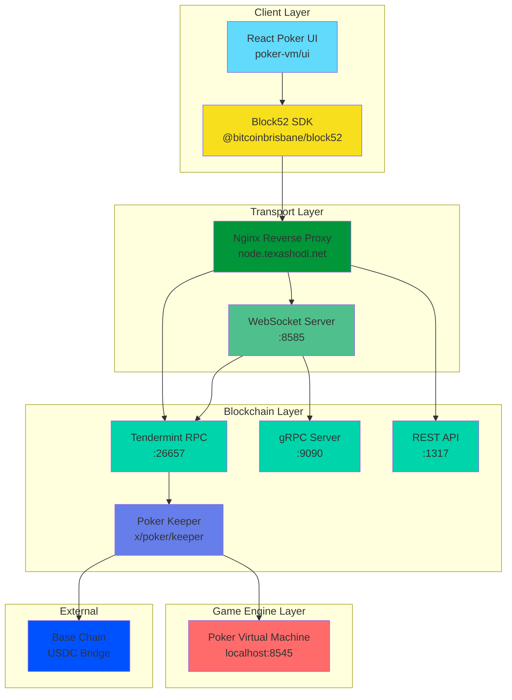

---

## Component Dependencies

### Dependency Graph

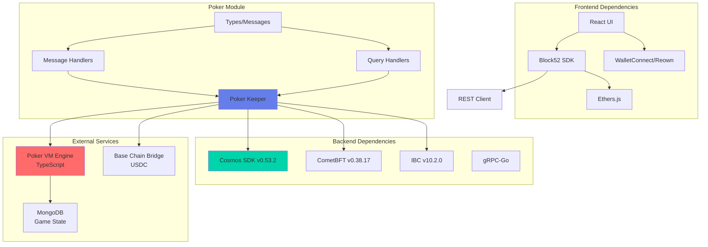

### Module Dependency Tree

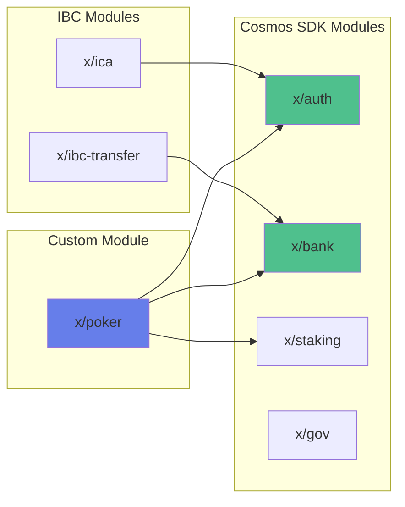

---

## Network Infrastructure

### Production Topology

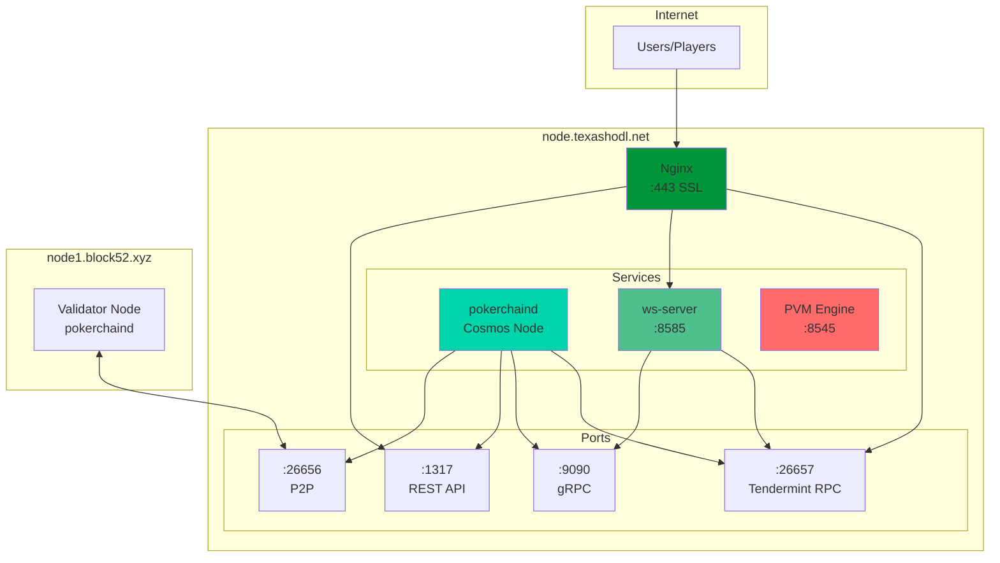

### Reverse Proxy Routes

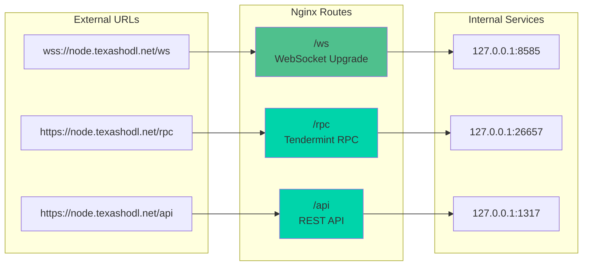

---

## Game Action Flows

### Join Game Flow

When a player joins a poker game:

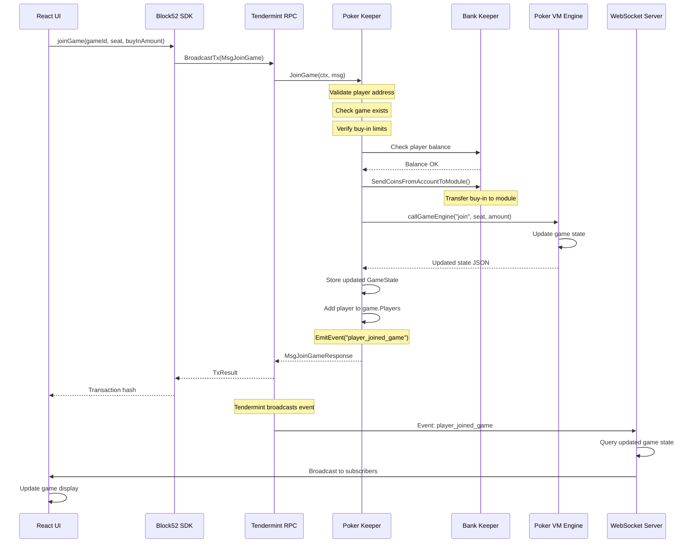

### Perform Action Flow

When a player performs a poker action (bet, call, raise, fold, etc.):

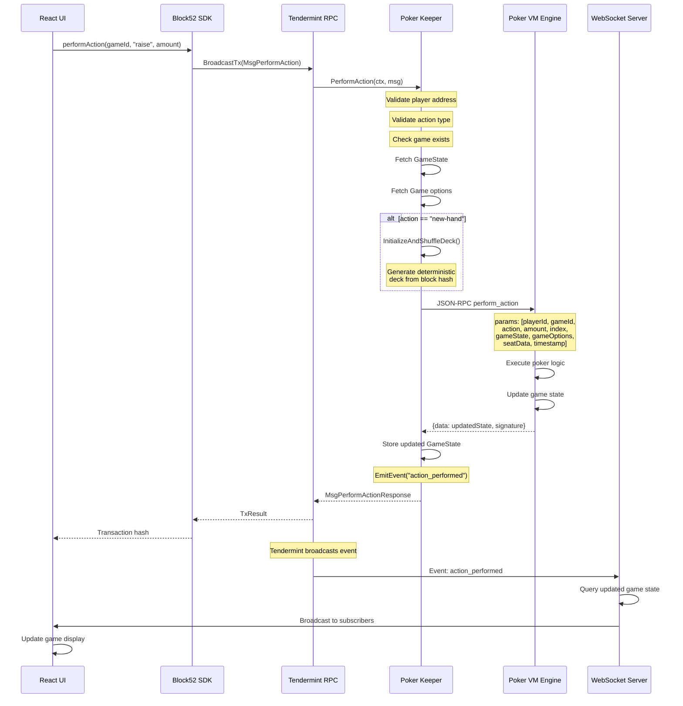

### Leave Game Flow

When a player leaves a poker game:

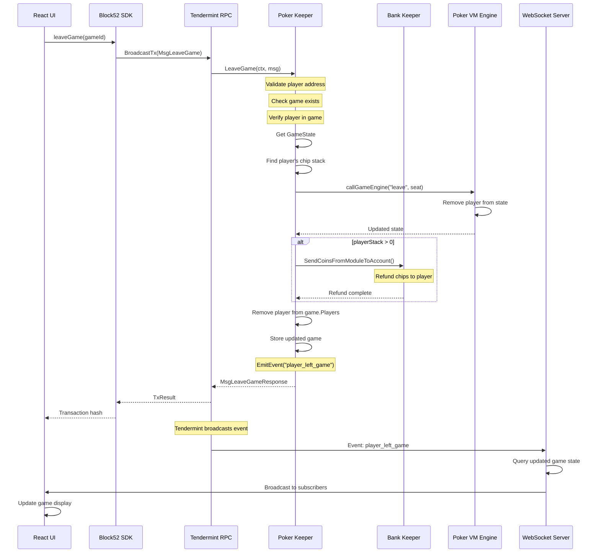

---

## WebSocket Real-Time Updates

### Event Flow Architecture

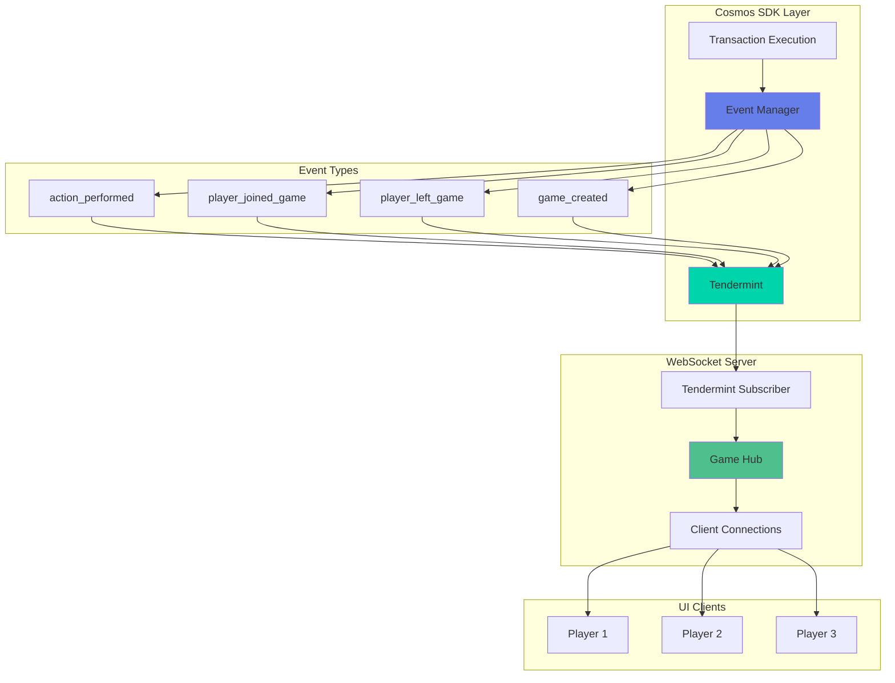

### WebSocket Subscription Flow

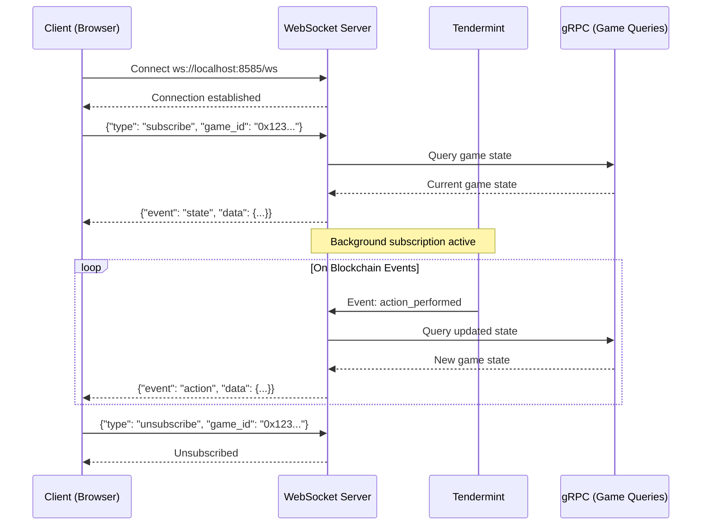

### Tendermint Event Subscription

The WebSocket server subscribes to Tendermint events:

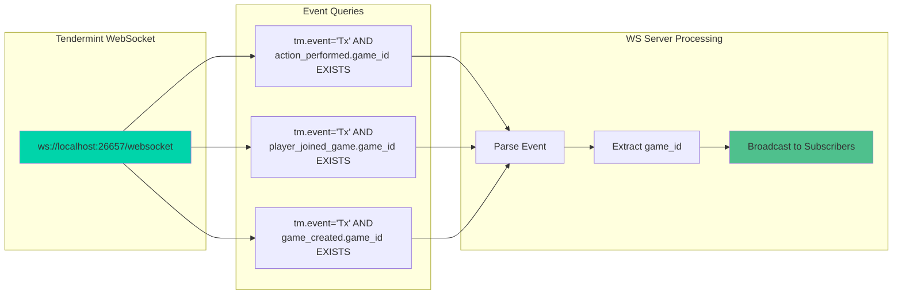

---

## Reverse Proxy Configuration

### Nginx Configuration for node.texashodl.net

```nginx
# WebSocket endpoint with upgrade support
location /ws {
    proxy_pass http://127.0.0.1:8585/;
    proxy_http_version 1.1;
    proxy_set_header Upgrade $http_upgrade;
    proxy_set_header Connection "upgrade";
    proxy_set_header Host $host;
    proxy_set_header X-Real-IP $remote_addr;
    proxy_set_header X-Forwarded-For $proxy_add_x_forwarded_for;
    proxy_set_header X-Forwarded-Proto $scheme;
    proxy_read_timeout 86400;  # 24 hours for long-lived connections
}

# Tendermint RPC
location /rpc {
    proxy_pass http://127.0.0.1:26657/;
    proxy_http_version 1.1;
    proxy_set_header Host $host;
}

# REST API
location /api {
    proxy_pass http://127.0.0.1:1317/;
    proxy_http_version 1.1;
    proxy_set_header Host $host;
}

# gRPC (if using grpc-web)
location /grpc {
    grpc_pass grpc://127.0.0.1:9090;
}
```

### Service Port Summary

| Service | Port | Protocol | Description |
|---------|------|----------|-------------|
| WebSocket Server | 8585 | HTTP/WS | Real-time game updates |
| Tendermint RPC | 26657 | HTTP/WS | Blockchain RPC |
| gRPC | 9090 | gRPC | Direct blockchain queries |
| REST API | 1317 | HTTP | Cosmos REST endpoints |
| P2P | 26656 | TCP | Validator communication |
| Poker VM | 8545 | HTTP | Game engine JSON-RPC |

### Connection Flow Diagram

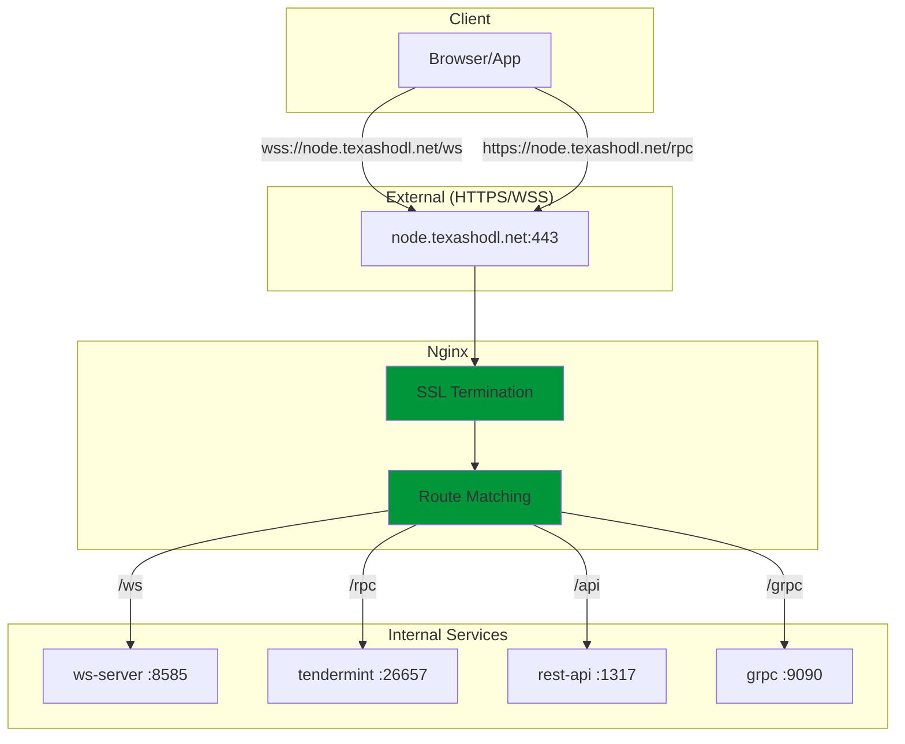

---

## SDK Integration Points

### UI to Blockchain Communication

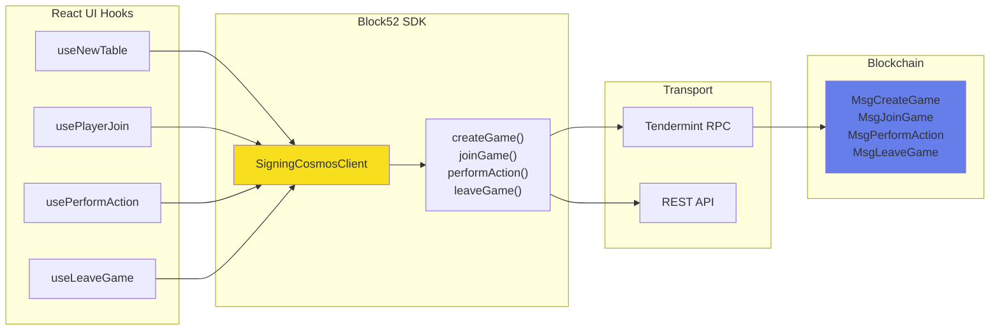

---

## Summary

The Pokerchain architecture consists of:

1. **Frontend**: React UI using Block52 SDK for blockchain interactions
2. **Reverse Proxy**: Nginx handling SSL and routing to internal services
3. **WebSocket Server**: Real-time game updates via Tendermint event subscription
4. **Cosmos Blockchain**: Poker keeper managing game state and token transfers
5. **Poker VM**: External game engine for poker logic validation
6. **Base Chain Bridge**: USDC deposit/withdrawal integration

Events flow from blockchain transactions through Tendermint, to the WebSocket server, and finally to subscribed UI clients for real-time updates.
