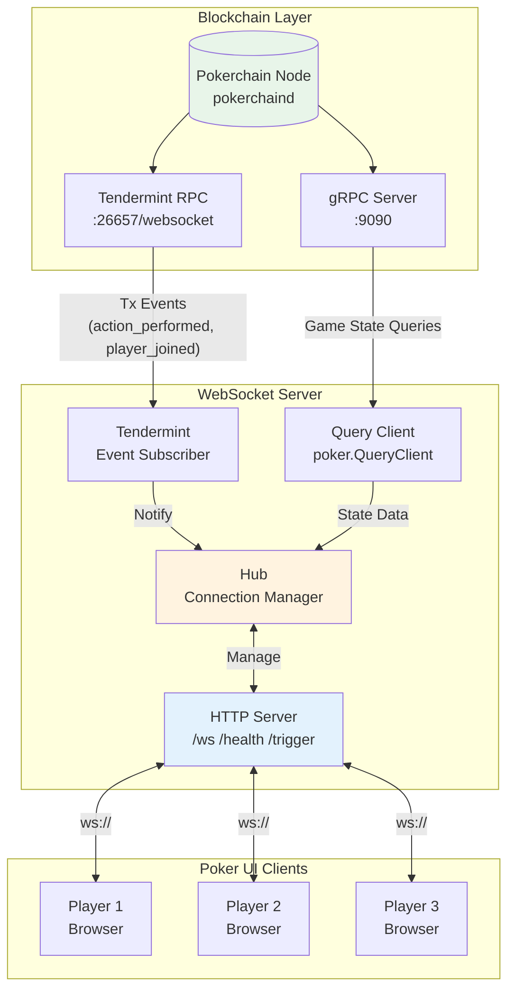
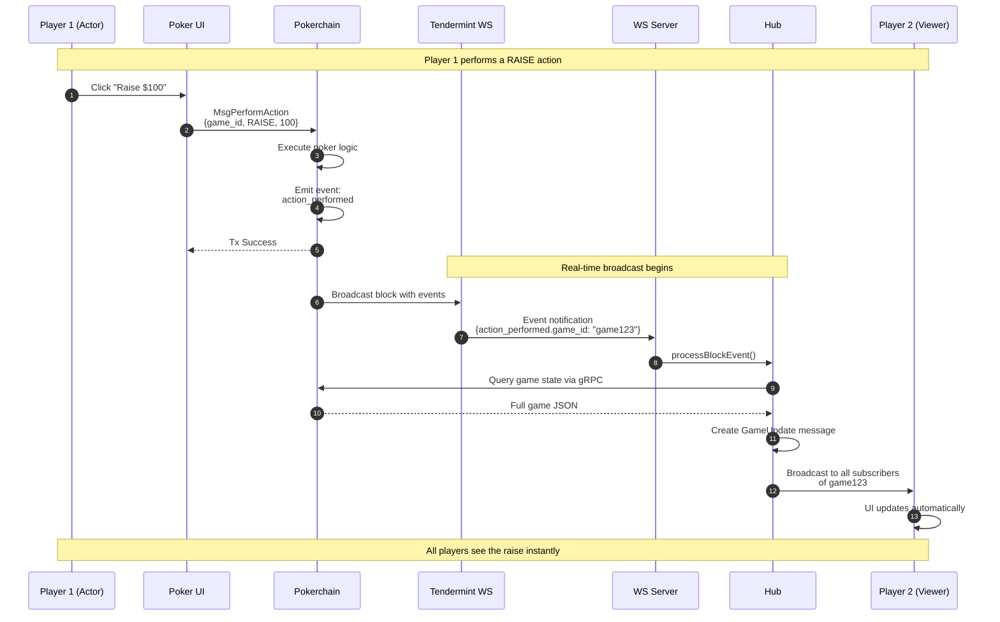
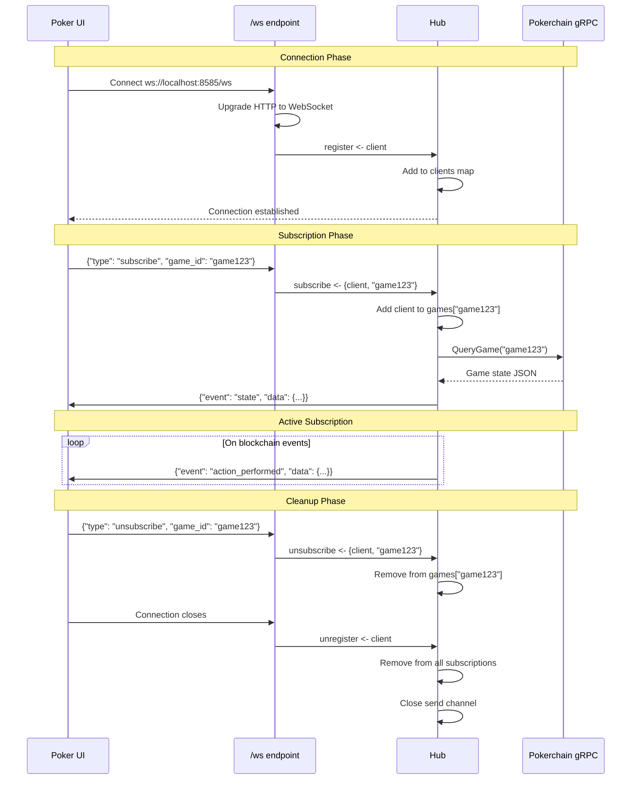
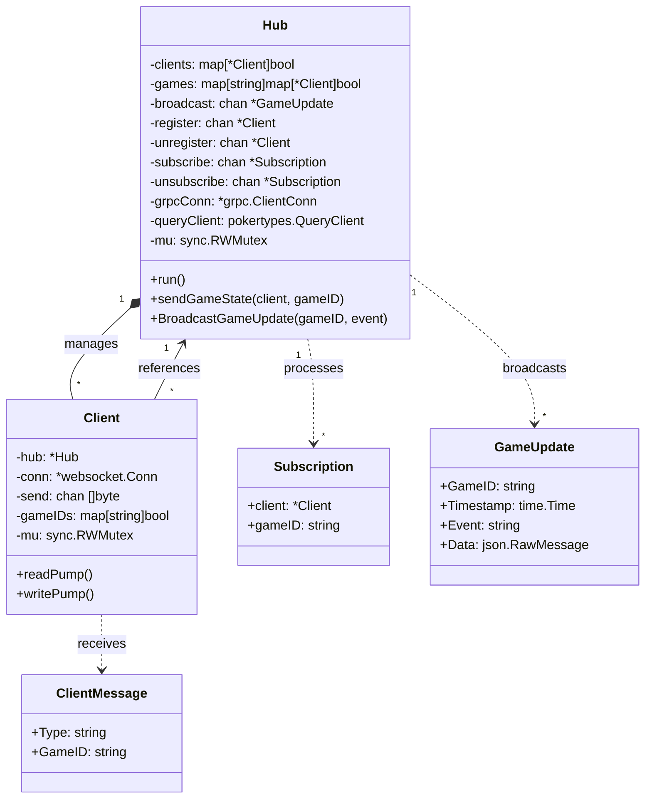
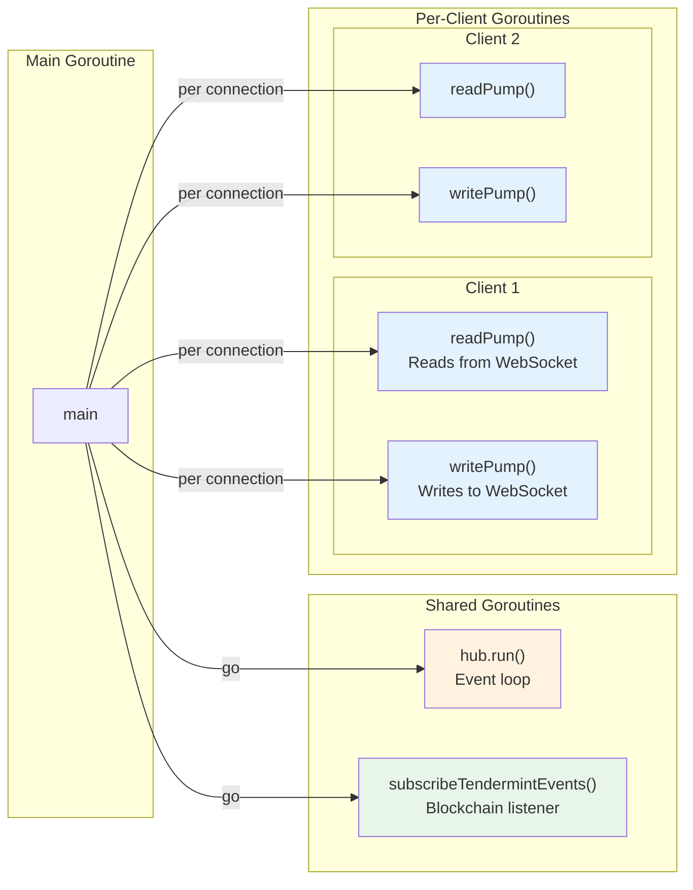
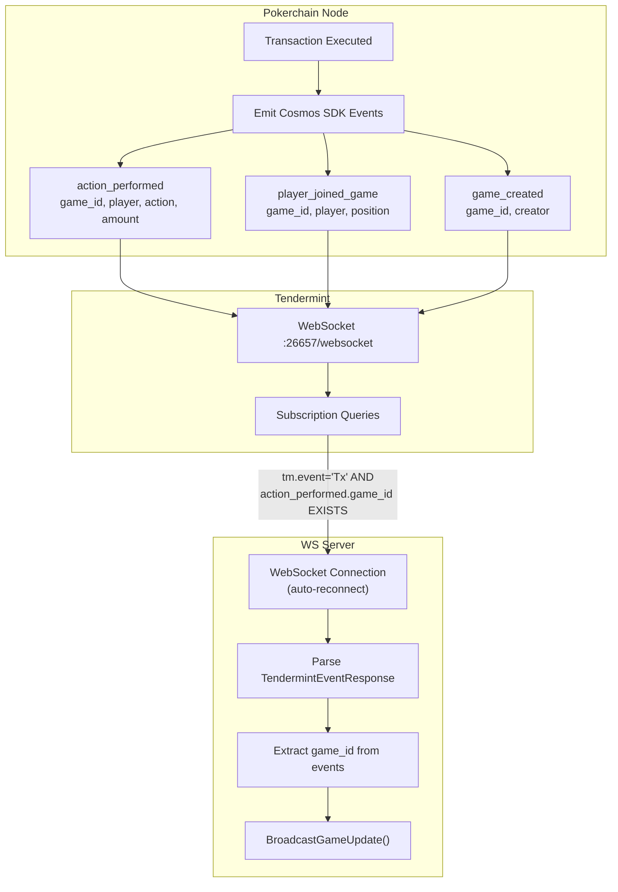
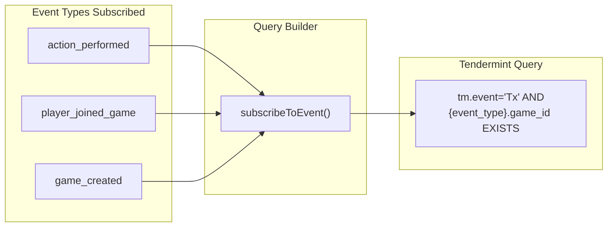
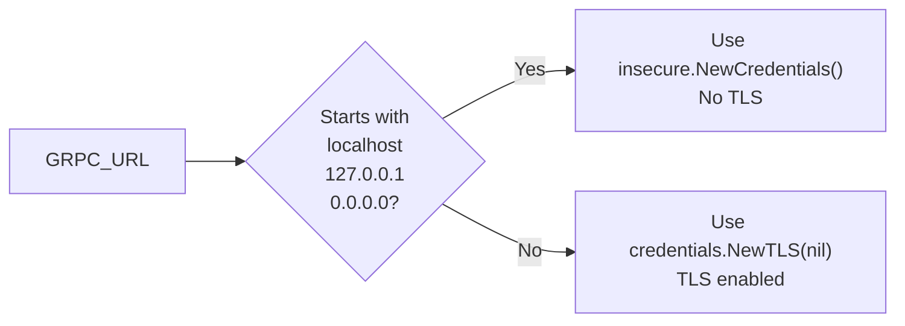
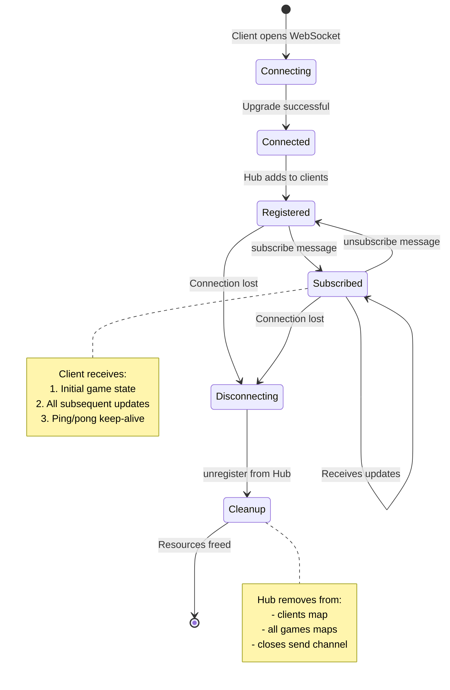

# Poker WebSocket Server

Real-time WebSocket server that bridges the Pokerchain blockchain with web clients, enabling live game state updates.

## Architecture Overview



## How It Works

### Complete Event Flow: Player Action to UI Update



### Client Connection & Subscription Flow



## Component Architecture

### Hub: The Central Nervous System



### Hub Event Loop (run method)

```mermaid
flowchart TB
    subgraph "Hub.run() - Infinite Select Loop"
        START((Start))
        SELECT{select}

        subgraph "Channel: register"
            REG[Add client to clients map<br/>Log: "Client registered"]
        end

        subgraph "Channel: unregister"
            UNREG[Remove from clients<br/>Unsubscribe from all games<br/>Close send channel<br/>Log: "Client unregistered"]
        end

        subgraph "Channel: subscribe"
            SUB[Add client to games[gameID]<br/>Add gameID to client.gameIDs<br/>Log: "Client subscribed"<br/>Go: sendGameState]
        end

        subgraph "Channel: unsubscribe"
            UNSUB[Remove client from games[gameID]<br/>Remove gameID from client.gameIDs<br/>Log: "Client unsubscribed"]
        end

        subgraph "Channel: broadcast"
            BCAST[Get subscribers for gameID<br/>Marshal GameUpdate to JSON<br/>Send to each client.send<br/>Log: "Broadcasted event"]
        end
    end

    START --> SELECT
    SELECT -->|"<-register"| REG
    SELECT -->|"<-unregister"| UNREG
    SELECT -->|"<-subscribe"| SUB
    SELECT -->|"<-unsubscribe"| UNSUB
    SELECT -->|"<-broadcast"| BCAST
    REG --> SELECT
    UNREG --> SELECT
    SUB --> SELECT
    UNSUB --> SELECT
    BCAST --> SELECT
```

### Goroutine Architecture



## Tendermint Event Subscription

### Event Flow from Blockchain



### Subscription Query Format



## Configuration

### Environment Variables

| Variable | Default | Description |
|----------|---------|-------------|
| `GRPC_URL` | `node.texashodl.net:9443` | Pokerchain gRPC endpoint |
| `TENDERMINT_WS_URL` | `ws://localhost:26657/websocket` | Tendermint WebSocket for events |
| `WS_SERVER_PORT` | `:8585` | Port for WebSocket server |
| `ADDRESS_PREFIX` | `b52` | Bech32 address prefix |

### TLS Auto-Detection



## API Endpoints

### WebSocket: `/ws`

Connect and subscribe to game updates.

**Client Messages:**
```json
// Subscribe to a game
{"type": "subscribe", "game_id": "game_abc123"}

// Unsubscribe from a game
{"type": "unsubscribe", "game_id": "game_abc123"}

// Keep-alive ping
{"type": "ping"}
```

**Server Messages:**
```json
// Initial state on subscribe
{
  "game_id": "game_abc123",
  "timestamp": "2025-01-15T10:30:00Z",
  "event": "state",
  "data": { /* full game state */ }
}

// Game update on blockchain event
{
  "game_id": "game_abc123",
  "timestamp": "2025-01-15T10:30:05Z",
  "event": "action_performed",
  "data": { /* updated game state */ }
}

// Pong response
{"type": "pong"}
```

### HTTP: `/health`

```bash
curl http://localhost:8585/health
```

```json
{
  "status": "ok",
  "clients": 5,
  "active_games": 2,
  "grpc_url": "localhost:9090",
  "tendermint_ws": "ws://localhost:26657/websocket"
}
```

### HTTP: `/trigger`

Manual event trigger for testing:

```bash
curl "http://localhost:8585/trigger?game_id=game123&event=test"
```

## Connection Lifecycle



## Running

### Local Development

```bash
# Option 1: Via setup-network.sh (recommended)
./setup-network.sh
# Choose 12 (Deploy WebSocket Server)
# Choose 1 (Local Development)

# Option 2: Direct with environment variables
GRPC_URL=localhost:9090 ./build/ws-server

# Option 3: Build and run
go build -o ./build/ws-server ./cmd/ws-server
./build/ws-server
```

### Production

```bash
# Deploy to remote server via setup-network.sh
./setup-network.sh
# Choose 12 (Deploy WebSocket Server)
# Choose 2 (Remote Production Server)
# Enter hostname: node1.block52.xyz
```

Creates systemd service with proper environment variables.

## JavaScript Client Example

```javascript
const ws = new WebSocket('ws://localhost:8585/ws');

ws.onopen = () => {
  console.log('Connected');

  // Subscribe to a game
  ws.send(JSON.stringify({
    type: 'subscribe',
    game_id: 'game_abc123'
  }));
};

ws.onmessage = (event) => {
  const update = JSON.parse(event.data);
  console.log(`Event: ${update.event}`, update.data);

  // Update UI based on event type
  switch(update.event) {
    case 'state':
      initializeGame(update.data);
      break;
    case 'action_performed':
      animateAction(update.data);
      break;
    case 'player_joined_game':
      addPlayer(update.data);
      break;
  }
};

ws.onclose = () => {
  console.log('Disconnected - implement reconnect logic');
};
```

## Troubleshooting

### Port Already in Use

The setup script now automatically kills existing processes:

```bash
# Manual check
lsof -i :8585

# Manual kill
kill $(lsof -t -i :8585)
```

### No Updates Received

1. Verify game exists: Query `/pokerchain/poker/v1/game/{game_id}`
2. Check subscription: Send subscribe message again
3. Test manually: `curl "http://localhost:8585/trigger?game_id=<id>&event=test"`
4. Check Tendermint connection in logs

### Connection Refused

1. Check server running: `lsof -i :8585`
2. Check gRPC connection: `grpcurl -plaintext localhost:9090 list`
3. Check Tendermint: `curl http://localhost:26657/status`

## Related Files

- `test-client.html` - Browser-based test client
- `setup-network.sh` option 12 - Deployment script
- `x/poker/keeper/` - Event emission in blockchain
