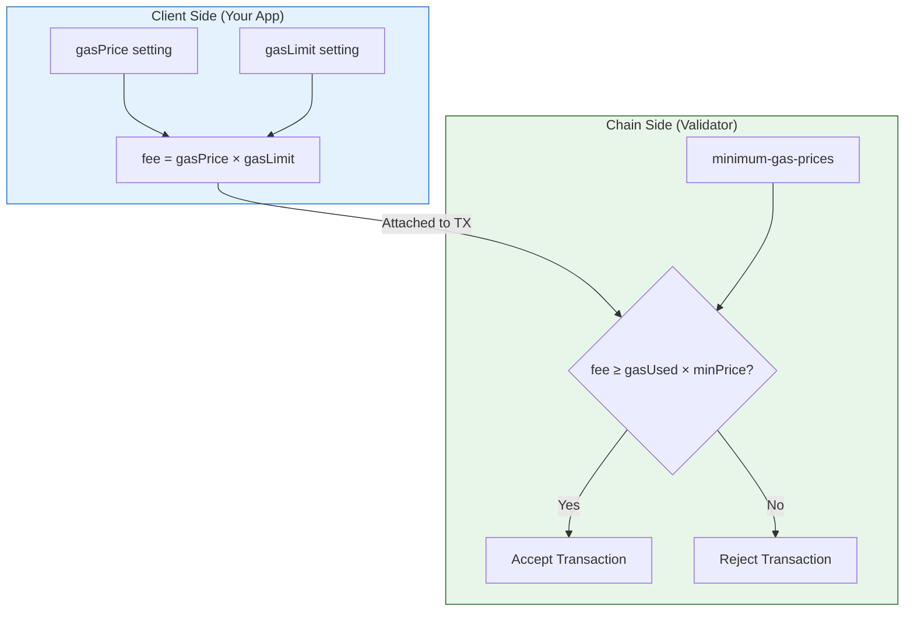
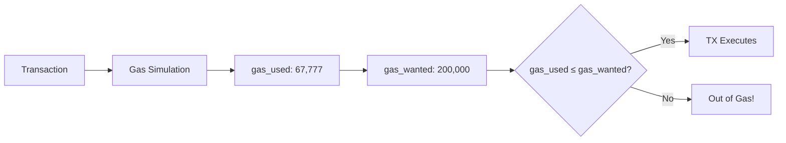
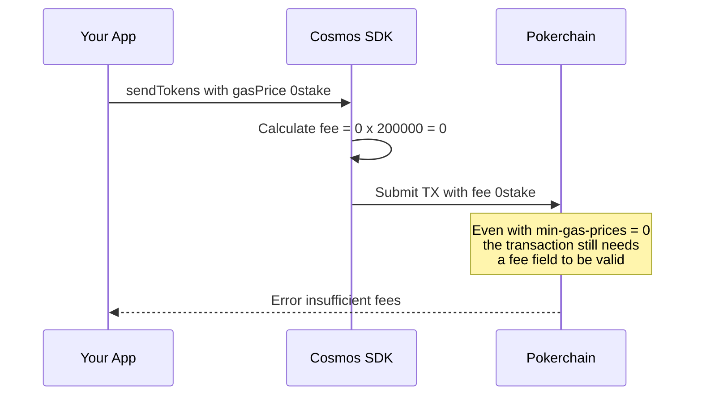
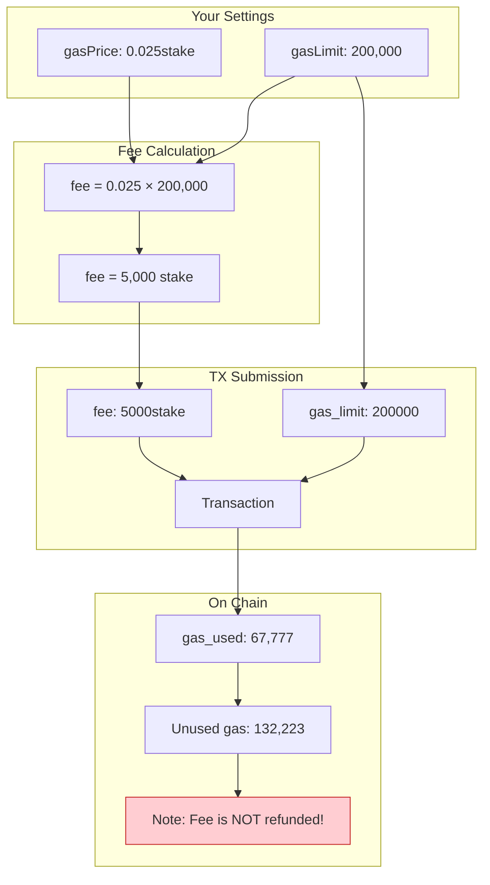
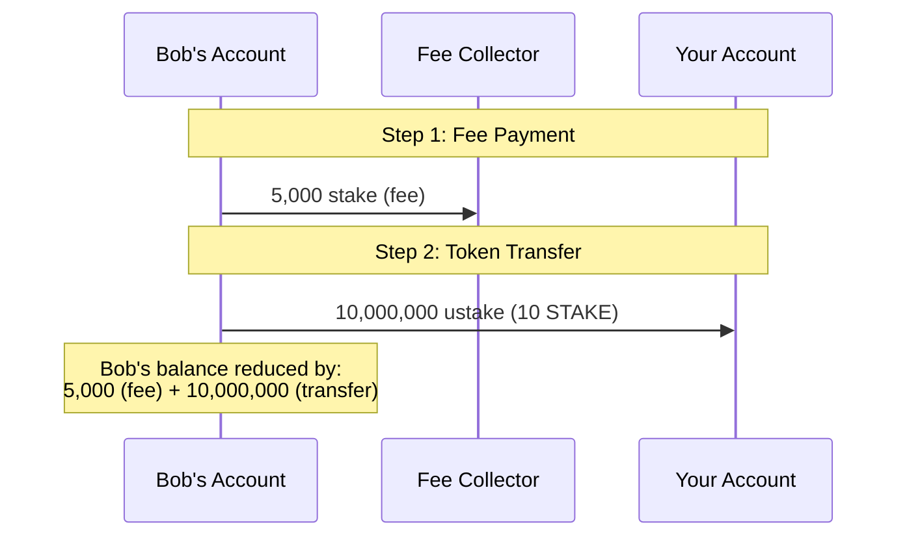
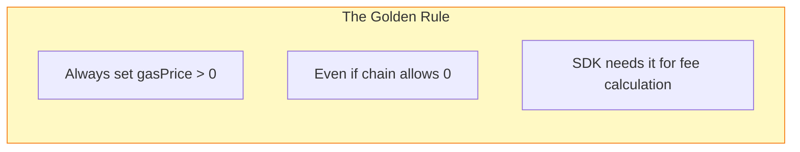
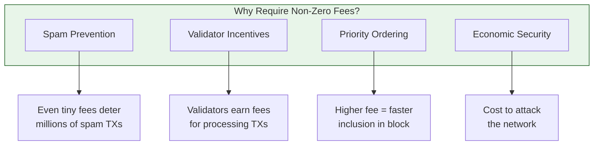
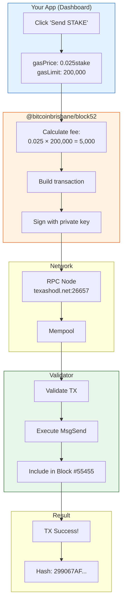

# Cosmos SDK Gas and Fees Explained

> **Purpose**: This document explains why we need to set `gasPrice` in our client code even when the chain's `minimum-gas-prices` is set to 0.

## The Confusion

You might expect:
- If `minimum-gas-prices = 0` on the chain → No fees needed
- But in practice: `gasPrice: "0stake"` causes transactions to fail!

**Why?** Because gas price and minimum gas prices serve different purposes.

---

## The Two Sides of Gas



---

## Key Concepts

### 1. Gas Limit (`gasLimit` / `gas_wanted`)

**What**: Maximum gas units the transaction is allowed to consume.



- **Your transaction**: `gas_used: 67,777` / `gas_wanted: 200,000`
- The 200,000 is a safe upper bound
- You only "pay" for what you use (sort of - see below)

### 2. Gas Price (`gasPrice`)

**What**: How much you're willing to pay per unit of gas.

```
fee = gasPrice × gasLimit
```

**Your transaction**:
```
fee = 0.025 stake × 200,000 gas = 5,000 stake
```

### 3. Minimum Gas Prices (`minimum-gas-prices`)

**What**: Chain/validator setting that rejects transactions below a threshold.

```yaml
# app.toml on validator
minimum-gas-prices = "0.001stake"
```

---

## Why `gasPrice: "0stake"` Fails

Even with `minimum-gas-prices = ""` (empty/zero):



**The Issue**: When gasPrice is 0, the SDK calculates `fee = 0`. But Cosmos SDK transactions require a non-empty fee field for the signature to be valid.

---

## The Real Fee Calculation



**Important**: You pay for `gasLimit`, not `gasUsed`! The fee (5000 stake) is deducted regardless of actual gas consumption.

---

## Breaking Down Your Transaction

| Field | Value | Explanation |
|-------|-------|-------------|
| `gas_wanted` | 200,000 | Maximum gas allowed |
| `gas_used` | 67,777 | Actual gas consumed |
| `fee` | 5,000 stake | `0.025 × 200,000` |
| `from_address` | Bob's address | Sender |
| `to_address` | Your address | Recipient |
| `amount` | 10,000,000 ustake | 10 STAKE |

### Transaction Events Explained



From your events:
1. **Fee payment**: `coin_spent: 5000stake` → `coin_received` by fee collector
2. **Transfer**: `coin_spent: 10000000stake` → `coin_received` by recipient

---

## The Golden Rule



### Recommended Values

| Environment | `gasPrice` | Rationale |
|-------------|------------|-----------|
| Local testnet | `"0.001stake"` | Minimal fees |
| Shared testnet | `"0.025stake"` | Safe buffer |
| Production | `"0.025stake"` | Competitive |

---

## Code Pattern

```typescript
// ❌ WRONG - Will fail even if chain allows 0 fees
const signingClient = await createSigningClientFromMnemonic({
    gasPrice: "0stake"  // Results in fee = 0
}, mnemonic);

// ✅ CORRECT - Always provide a gas price
const signingClient = await createSigningClientFromMnemonic({
    gasPrice: "0.025stake"  // Results in reasonable fee
}, mnemonic);
```

---

## Why Does This Design Exist?



Even when `minimum-gas-prices = 0`:
1. **SDK Design**: The SDK expects a fee to be calculated
2. **Signature**: The fee is part of what gets signed
3. **Validation**: Empty fees can cause validation issues

---

## Visual: Your Transaction Flow



---

## Summary

| Concept | Client-Side | Chain-Side |
|---------|-------------|------------|
| **Gas Price** | `gasPrice: "0.025stake"` | `minimum-gas-prices: "0.001stake"` |
| **Purpose** | Calculate fee to attach | Reject low-fee TXs |
| **Set Where** | SDK client config | Validator app.toml |
| **When 0** | Fee = 0 → TX fails | Accepts any fee ≥ 0 |

**Key Takeaway**: Always set `gasPrice > 0` in your client code, regardless of chain settings. The SDK needs it to calculate and attach a valid fee to your transaction.

---

## Reference: Your Working Configuration

```typescript
// From useCosmosWallet.ts
const signingClient = await createSigningClientFromMnemonic(
    {
        rpcEndpoint: currentNetwork.rpc,
        restEndpoint: currentNetwork.rest,
        chainId: "pokerchain",
        prefix: "b52",
        denom: "stake",
        gasPrice: "0.025stake"  // ← This is required!
    },
    mnemonic
);
```

This produces transactions like:
- **Gas Wanted**: 200,000
- **Gas Used**: ~67,000 (for MsgSend)
- **Fee**: 5,000 stake
- **Result**: Success!
