# Genesis Initialization Methods Comparison

This document compares the two methods of initializing genesis for the Pokerchain blockchain:
1. **config.yml Method (Ignite CLI)** - Development-focused
2. **CLI Commands Method** - Production-like

---

## Visual Side-by-Side Comparison

```mermaid
flowchart LR
    subgraph CONFIG["config.yml Method (Ignite)"]
        direction TB
        C1["<b>ignite chain serve --reset-once</b>"]
        C2["Reads config.yml<br/>accounts + validators"]
        C3["Auto: pokerchaind init"]
        C4["Auto: keys add alice, bob, etc."]
        C5["Auto: add-genesis-account<br/>for all 10 accounts"]
        C6["Auto: gentx for alice"]
        C7["Auto: collect-gentxs"]
        C8["Auto: CORS + API config"]
        C9["<b>Auto: Start chain</b>"]
        C1 --> C2 --> C3 --> C4 --> C5 --> C6 --> C7 --> C8 --> C9

        style C1 fill:#d4edda,stroke:#333,stroke-width:3px,color:#000
        style C2 fill:#e2e3e5,stroke:#333,stroke-width:2px,color:#000
        style C3 fill:#e2e3e5,stroke:#333,stroke-width:2px,color:#000
        style C4 fill:#e2e3e5,stroke:#333,stroke-width:2px,color:#000
        style C5 fill:#e2e3e5,stroke:#333,stroke-width:2px,color:#000
        style C6 fill:#e2e3e5,stroke:#333,stroke-width:2px,color:#000
        style C7 fill:#e2e3e5,stroke:#333,stroke-width:2px,color:#000
        style C8 fill:#e2e3e5,stroke:#333,stroke-width:2px,color:#000
        style C9 fill:#d4edda,stroke:#333,stroke-width:3px,color:#000
    end

    subgraph CLI["CLI Commands Method (Production)"]
        direction TB
        P1["<b>pokerchaind init node1<br/>--chain-id pokerchain</b>"]
        P2["pokerchaind keys add validator"]
        P3["<b>pokerchaind genesis<br/>add-genesis-account<br/>1000000000000stake,<br/>1000000000usdc</b>"]
        P4["pokerchaind genesis gentx<br/>validator 5000000000stake"]
        P5["pokerchaind genesis<br/>collect-gentxs"]
        P6["<b>pokerchaind genesis validate</b>"]
        P7["sed -i CORS config"]
        P8["sed -i API config"]
        P9["<b>pokerchaind start</b>"]
        P1 --> P2 --> P3 --> P4 --> P5 --> P6 --> P7 --> P8 --> P9

        style P1 fill:#f8d7da,stroke:#333,stroke-width:3px,color:#000
        style P2 fill:#e2e3e5,stroke:#333,stroke-width:2px,color:#000
        style P3 fill:#fff3cd,stroke:#333,stroke-width:3px,color:#000
        style P4 fill:#e2e3e5,stroke:#333,stroke-width:2px,color:#000
        style P5 fill:#e2e3e5,stroke:#333,stroke-width:2px,color:#000
        style P6 fill:#fff3cd,stroke:#333,stroke-width:3px,color:#000
        style P7 fill:#e2e3e5,stroke:#333,stroke-width:2px,color:#000
        style P8 fill:#e2e3e5,stroke:#333,stroke-width:2px,color:#000
        style P9 fill:#d4edda,stroke:#333,stroke-width:3px,color:#000
    end

    CONFIG -.5 seconds.-> C9
    CLI -.30 seconds.-> P9
```



### Key Differences Highlighted

| Step | config.yml (Ignite) | CLI Commands (Production) |
|------|---------------------|---------------------------|
| **Init** | Hidden (auto) | ✅ `pokerchaind init node1 --chain-id pokerchain` |
| **Denom** | Uses config.yml | ⚠️ **Uses hardcoded default from app.go** |
| **Accounts** | 10 auto (alice-jack) | Manual - only what you create |
| **USDC** | Via config.yml | ✅ `1000000000usdc` explicitly in add-genesis-account |
| **Validation** | Hidden (auto) | ✅ **Explicit `genesis validate` step** |
| **Gentx** | Auto for alice | Manual for validator |
| **CORS** | Auto-enabled | Manual sed commands |
| **Visibility** | 🔒 Hidden | ✅ Full visibility |

---

## Production Denom Discovery 🔍

### Where does production get the denom?

**Answer: It's HARDCODED in `app/app.go` at line 110**

```go
// File: /pokerchain/app/app.go
// Line 110
sdk.DefaultBondDenom = "stake"
```

**Production setup script (`setup-production-nodes.sh`) at line 611:**
```bash
$CHAIN_BINARY init $NODE_MONIKER --chain-id $CHAIN_ID --home $NODE_HOME
# ⚠️ NO --default-denom flag specified!
# Uses the hardcoded default from app.go which is "stake"
```

**So:**
- ❌ `config.yml` says `default_denom: b52Token` (only used by Ignite, not production)
- ✅ **Production actually uses `"stake"`** (from app.go:110)
- ✅ Local testnet uses `"stake"` (matches production)

**If you want b52Token in production**, you need to either:
1. Change app.go line 110 to `sdk.DefaultBondDenom = "b52Token"`
2. OR add `--default-denom b52Token` to the init command in setup-production-nodes.sh

---

## Quick Summary

| Aspect | config.yml Method | CLI Commands Method |
|--------|------------------|---------------------|
| **Tool** | `ignite chain serve` | `pokerchaind genesis` |
| **Speed** | ~5 seconds | ~15-30 seconds |
| **Complexity** | Simple (1 command) | Manual (7+ commands) |
| **Production Similarity** | Low | High |
| **Best For** | Rapid development iteration | Pre-production testing, withdrawal testing |
| **Bugs Caught** | Development bugs only | Production genesis bugs |
| **USDC in Genesis** | Via config.yml (auto) | Manual CLI flag |

---

## Method 1: config.yml (Ignite CLI)

### How It Works

**Single Command:**
```bash
ignite chain serve --reset-once
```

**Configuration File (`config.yml`):**
```yaml
accounts:
    - name: alice
      coins:
          - 10000000000000b52Token
          - 1000000000usdc
      mnemonic: cement shadow leave crash crisp aisle model...
    - name: bob
      coins:
          - 10000000000000b52Token
          - 1000000000usdc
      mnemonic: vanish legend pelican blush control spike...

validators:
    - name: alice
      bonded: 5000000000000b52Token

bridge:
    enabled: true
    ethereum_rpc_url: "https://mainnet.base.org"
    deposit_contract_address: "0xcc391c8f1aFd6DB5D8b0e064BA81b1383b14FE5B"
    usdc_contract_address: "0x833589fCD6eDb6E08f4c7C32D4f71b54bdA02913"
    polling_interval_seconds: 15
    starting_block: 0
    validator_eth_private_key: "bd78d63f1c1441e73e8b3e33263a0357b2673daf43eb52a75431da6ca413aae8"
```

### What Ignite Does Behind the Scenes

1. **Initialization:**
   ```bash
   pokerchaind init <moniker> --chain-id pokerchain
   ```

2. **Account Creation (Automated):**
   - Reads `config.yml` accounts section
   - Creates keys for alice, bob, charlie, etc.
   - Adds all accounts to genesis with specified coins
   - Stores mnemonics internally

3. **Validator Setup (Automated):**
   - Uses first validator from `config.yml`
   - Creates gentx automatically
   - Bonds specified stake amount

4. **Bridge Configuration (Automated):**
   - Injects bridge config into `app.toml`
   - Copies all settings from `config.yml`

5. **Genesis Finalization:**
   - Collects gentxs
   - Validates genesis
   - Starts the chain

### Advantages

✅ **Speed**: 5 seconds total
✅ **Consistency**: Same genesis every time
✅ **Easy**: One command
✅ **Development**: Perfect for rapid iteration
✅ **Predefined Accounts**: 10 accounts (alice-jack) with mnemonics

### Disadvantages

❌ **Not Production-Like**: Different tooling than production
❌ **Hidden Steps**: Don't see what's happening
❌ **Genesis Bugs**: Might miss production issues
❌ **Less Control**: Can't customize genesis process
❌ **Ignite Dependency**: Requires Ignite CLI installed

---

## Method 2: CLI Commands (Production)

### How It Works

**Script Location:** `run-local-testnet.sh` → Option 7 → Initialize → Option 2

### Step-by-Step Commands

**1. Initialize Chain:**
```bash
pokerchaind init node1 --chain-id pokerchain --home ~/.testnet/node1 --default-denom stake
```
**What it does:**
- Creates `~/.testnet/node1/` directory structure
- Generates `genesis.json` with chain-id "pokerchain"
- Creates initial `config.toml` and `app.toml`
- Sets default denomination to "stake"

**Output Files:**
```
~/.testnet/node1/
├── config/
│   ├── genesis.json      (initial - no accounts yet)
│   ├── config.toml       (P2P, consensus settings)
│   └── app.toml          (API, gRPC, bridge settings)
└── data/
```

---

**2. Create Validator Key:**
```bash
pokerchaind keys add validator --keyring-backend test --home ~/.testnet/node1
```
**What it does:**
- Generates new secp256k1 keypair
- Stores in test keyring (no password required)
- Outputs address and mnemonic

**Example Output:**
```
- address: b52qj7l5r9kx8h2m3n4p5q6r7s8t9u0v1w2x3y4z
  name: validator
  pubkey: '{"@type":"/cosmos.crypto.secp256k1.PubKey","key":"A..."}'
  type: local

**Important** write this mnemonic phrase in a safe place.
It is the only way to recover your account if you ever forget your password.

cement shadow leave crash crisp aisle model hip lend february library ten...
```

---

**3. Add Genesis Account with USDC:**
```bash
pokerchaind genesis add-genesis-account b52qj7l5r9kx8h2m3n4p5q6r7s8t9u0v1w2x3y4z \
    1000000000000stake,1000000000usdc \
    --home ~/.testnet/node1
```
**What it does:**
- **Modifies `genesis.json`** directly
- Adds account to `app_state.auth.accounts[]`
- Adds balances to `app_state.bank.balances[]`
- Sets sequence and account_number

**Genesis JSON Changes:**
```json
{
  "app_state": {
    "auth": {
      "accounts": [
        {
          "@type": "/cosmos.auth.v1beta1.BaseAccount",
          "address": "b52qj7l5r9kx8h2m3n4p5q6r7s8t9u0v1w2x3y4z",
          "pub_key": null,
          "account_number": "0",
          "sequence": "0"
        }
      ]
    },
    "bank": {
      "balances": [
        {
          "address": "b52qj7l5r9kx8h2m3n4p5q6r7s8t9u0v1w2x3y4z",
          "coins": [
            {"denom": "stake", "amount": "1000000000000"},
            {"denom": "usdc", "amount": "1000000000"}
          ]
        }
      ]
    }
  }
}
```

**🎯 CRITICAL FOR WITHDRAWALS:**
- **1000000000usdc** = 1000 USDC (6 decimals)
- This is THE initial USDC supply in the Cosmos chain
- Required for withdrawal testing (can't withdraw what doesn't exist!)

---

**4. Create Genesis Transaction (gentx):**
```bash
pokerchaind genesis gentx validator 5000000000stake \
    --chain-id pokerchain \
    --keyring-backend test \
    --home ~/.testnet/node1
```
**What it does:**
- Creates a **self-delegation** transaction
- Validator stakes 5000000000stake (5000 stake tokens)
- Generates signed transaction file
- Stores in `~/.testnet/node1/config/gentx/gentx-*.json`

**gentx File (`gentx-b52abc123.json`):**
```json
{
  "body": {
    "messages": [
      {
        "@type": "/cosmos.staking.v1beta1.MsgCreateValidator",
        "description": {
          "moniker": "node1",
          "identity": "",
          "website": "",
          "security_contact": "",
          "details": ""
        },
        "commission": {
          "rate": "0.100000000000000000",
          "max_rate": "0.200000000000000000",
          "max_change_rate": "0.010000000000000000"
        },
        "min_self_delegation": "1",
        "delegator_address": "b52qj7l5r9kx8h2m3n4p5q6r7s8t9u0v1w2x3y4z",
        "validator_address": "b52valoper1...",
        "pubkey": {
          "@type": "/cosmos.crypto.ed25519.PubKey",
          "key": "..."
        },
        "value": {
          "denom": "stake",
          "amount": "5000000000"
        }
      }
    ]
  },
  "signatures": ["..."]
}
```

---

**5. Collect Genesis Transactions:**
```bash
pokerchaind genesis collect-gentxs --home ~/.testnet/node1
```
**What it does:**
- Reads all `gentx-*.json` files from `config/gentx/`
- **Injects them into `genesis.json`** at `app_state.genutil.gen_txs[]`
- Updates validator set in genesis

**Genesis JSON After collect-gentxs:**
```json
{
  "app_state": {
    "genutil": {
      "gen_txs": [
        {
          "body": {
            "messages": [
              {
                "@type": "/cosmos.staking.v1beta1.MsgCreateValidator",
                ...
              }
            ]
          }
        }
      ]
    }
  }
}
```

---

**6. Validate Genesis:**
```bash
pokerchaind genesis validate --home ~/.testnet/node1
```
**What it does:**
- **Validates all genesis invariants:**
  - Account balances match total supply
  - Validator stakes are valid
  - No duplicate accounts
  - Chain parameters are valid
  - Module genesis states are correct

**Example Output:**
```
File at /Users/alexmiller/.testnet/node1/config/genesis.json is a valid genesis file
```

**If Invalid:**
```
Error: invalid genesis file: total supply mismatch: expected 1000000000000stake, got 995000000000stake
```

---

**7. Configure CORS and API:**
```bash
# Enable CORS in config.toml
sed -i.bak 's/cors_allowed_origins = \[\]/cors_allowed_origins = \["\*"\]/' \
    ~/.testnet/node1/config/config.toml

# Enable API in app.toml
sed -i.bak 's/enable = false/enable = true/' ~/.testnet/node1/config/app.toml

# Enable API CORS
sed -i.bak 's/enabled-unsafe-cors = false/enabled-unsafe-cors = true/' \
    ~/.testnet/node1/config/app.toml
```

**What it does:**
- **CORS in config.toml**: Allows RPC requests from any origin (development only!)
- **API Enable**: Turns on REST API server (port 1317)
- **API CORS**: Allows UI at `http://localhost:5173` to make API calls

**Security Note:** 🔒
- `cors_allowed_origins = ["*"]` is ONLY for development
- Production should specify exact origins: `["https://app.block52.xyz"]`

---

**8. Optional: Configure Bridge in app.toml:**
```bash
# Manually edit ~/.testnet/node1/config/app.toml
[bridge]
enabled = true
ethereum_rpc_url = "https://mainnet.base.org"
deposit_contract_address = "0xcc391c8f1aFd6DB5D8b0e064BA81b1383b14FE5B"
usdc_contract_address = "0x833589fCD6eDb6E08f4c7C32D4f71b54bdA02913"
polling_interval_seconds = 15
starting_block = 0
validator_eth_private_key = "bd78d63f1c1441e73e8b3e33263a0357b2673daf43eb52a75431da6ca413aae8"
```

**What it does:**
- Configures bridge for automatic withdrawal signing
- `validator_eth_private_key`: Ethereum key for signing withdrawals on Base
- Chain will auto-sign withdrawals in EndBlocker if key is set

---

### Final Directory Structure

```
~/.testnet/node1/
├── config/
│   ├── genesis.json           (✅ Complete with accounts, validators, gentxs)
│   ├── config.toml            (✅ CORS enabled)
│   ├── app.toml               (✅ API + CORS enabled, bridge configured)
│   ├── node_key.json          (Node P2P identity)
│   ├── priv_validator_key.json (Validator consensus key)
│   └── gentx/
│       └── gentx-abc123.json  (Genesis transaction)
├── data/
│   └── priv_validator_state.json
└── keyring-test/
    └── validator.info         (Validator key)
```

---

### Advantages

✅ **Production-Like**: Exact same process as production
✅ **Control**: Full visibility into each step
✅ **Debugging**: See exactly where issues occur
✅ **Validation**: Explicit genesis validation step
✅ **USDC Testing**: Can add exact USDC amounts needed
✅ **Catches Bugs**: Genesis bugs appear in development
✅ **No Ignite**: Works on any server with pokerchaind

### Disadvantages

❌ **Slower**: 15-30 seconds
❌ **Manual**: 7+ commands to run
❌ **Complex**: Need to understand each step
❌ **Error-Prone**: Easy to miss a step
❌ **No Predefined Accounts**: Must create your own

---

## Side-by-Side Comparison

### Genesis Account Creation

**config.yml Method:**
```yaml
# In config.yml
accounts:
    - name: alice
      coins:
          - 10000000000000b52Token
          - 1000000000usdc
      mnemonic: cement shadow leave crash...
```
- Ignite reads this and calls `pokerchaind genesis add-genesis-account` for you
- Mnemonic is stored in config.yml (⚠️ security risk in production!)
- 10 accounts created automatically (alice, bob, charlie, diana, eve, frank, grace, henry, iris, jack)

**CLI Method:**
```bash
# Step 1: Create key
pokerchaind keys add validator --keyring-backend test

# Step 2: Add to genesis
validator_addr=$(pokerchaind keys show validator -a --keyring-backend test)
pokerchaind genesis add-genesis-account "$validator_addr" 1000000000000stake,1000000000usdc
```
- Manual process - you see the mnemonic
- Only accounts you explicitly create
- Full control over amounts

---

### Validator Setup

**config.yml Method:**
```yaml
# In config.yml
validators:
    - name: alice
      bonded: 5000000000000b52Token
```
- Ignite automatically creates gentx
- Uses alice as validator
- Bonds specified amount

**CLI Method:**
```bash
pokerchaind genesis gentx validator 5000000000stake \
    --chain-id pokerchain \
    --keyring-backend test

pokerchaind genesis collect-gentxs
```
- Manual gentx creation
- Manual collection
- See the actual gentx JSON file

---

### CORS Configuration

**config.yml Method:**
- ✅ Automatically enabled by Ignite
- ⚠️ Might not match production settings

**CLI Method:**
```bash
sed -i.bak 's/cors_allowed_origins = \[\]/cors_allowed_origins = \["\*"\]/' config.toml
sed -i.bak 's/enabled-unsafe-cors = false/enabled-unsafe-cors = true/' app.toml
```
- ✅ Explicit configuration
- ✅ Same commands as production
- ✅ Visible in script

---

## Which Method Should You Use?

### Use config.yml (Ignite) When:
- 🚀 **Rapid development** iteration
- 🔄 **Frequent resets** (testing module changes)
- 👤 **Solo development** (not deploying to production yet)
- 🎯 **Module testing** (not testing genesis/deployment)

### Use CLI Method When:
- 🏭 **Pre-production testing** (final checks before deploy)
- 💰 **Withdrawal testing** (needs exact USDC amounts)
- 🐛 **Genesis debugging** (finding genesis-related bugs)
- 📦 **Production rehearsal** (want to practice deployment)
- 🔒 **Security testing** (want production-like security)

---

## Withdrawal Testing Recommendation

**✅ Use CLI Method (Option 2)**

**Why:**
1. **USDC in Genesis**: Explicitly adds 1000000000usdc to genesis
   ```bash
   pokerchaind genesis add-genesis-account "$validator_addr" 1000000000000stake,1000000000usdc
   ```
2. **Production-Like**: Same process as production where USDC is added to genesis
3. **Validation**: Explicit `genesis validate` step catches balance mismatches
4. **Bridge Config**: Manual configuration of validator signing key
5. **Bug Detection**: Catches genesis bugs that only appear in production

**What Could Go Wrong with config.yml:**
- Ignite might not preserve USDC denomination correctly
- Bridge config might not be injected properly
- Genesis validation might be skipped
- Different from production deployment process

---

## Example: Complete CLI Workflow (1 Node)

```bash
# 1. Clean slate
rm -rf ~/.testnet/node1

# 2. Initialize
pokerchaind init node1 --chain-id pokerchain --home ~/.testnet/node1 --default-denom stake

# 3. Create validator key
pokerchaind keys add validator --keyring-backend test --home ~/.testnet/node1

# 4. Get address
VALIDATOR_ADDR=$(pokerchaind keys show validator -a --keyring-backend test --home ~/.testnet/node1)

# 5. Add to genesis with USDC
pokerchaind genesis add-genesis-account "$VALIDATOR_ADDR" 1000000000000stake,1000000000usdc --home ~/.testnet/node1

# 6. Create gentx
pokerchaind genesis gentx validator 5000000000stake \
    --chain-id pokerchain \
    --keyring-backend test \
    --home ~/.testnet/node1

# 7. Collect gentxs
pokerchaind genesis collect-gentxs --home ~/.testnet/node1

# 8. Validate
pokerchaind genesis validate --home ~/.testnet/node1

# 9. Configure CORS
sed -i.bak 's/cors_allowed_origins = \[\]/cors_allowed_origins = \["\*"\]/' ~/.testnet/node1/config/config.toml
sed -i.bak 's/enable = false/enable = true/' ~/.testnet/node1/config/app.toml
sed -i.bak 's/enabled-unsafe-cors = false/enabled-unsafe-cors = true/' ~/.testnet/node1/config/app.toml

# 10. Start node
pokerchaind start --home ~/.testnet/node1
```

**Time:** ~30 seconds
**Result:** Production-ready local testnet with USDC for withdrawal testing

---

## Summary

| Method | Speed | Complexity | Production Similarity | Withdrawal Testing |
|--------|-------|------------|----------------------|-------------------|
| **config.yml** | ⚡⚡⚡ Fast | ✅ Simple | ❌ Low | ⚠️ Uncertain |
| **CLI Commands** | ⚡ Slower | ⚠️ Complex | ✅ High | ✅ Recommended |

**For withdrawal testing: Use CLI Method (Option 2)** 🎯
