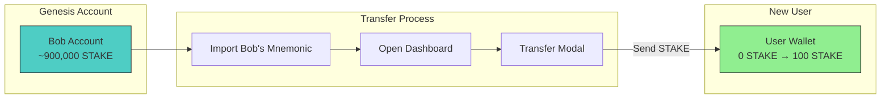
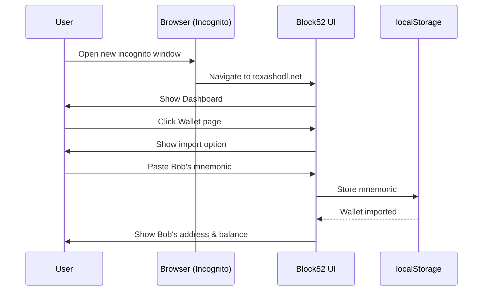
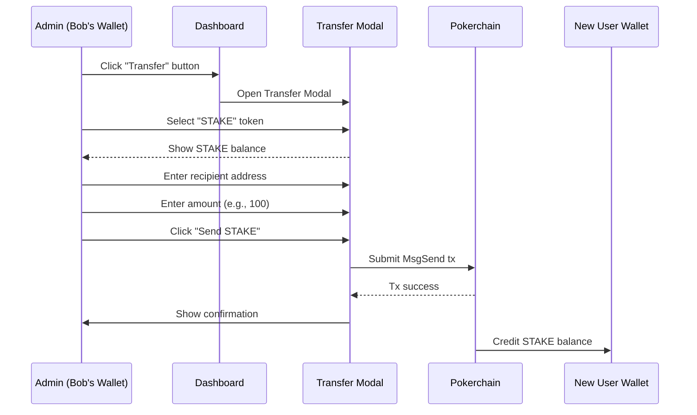
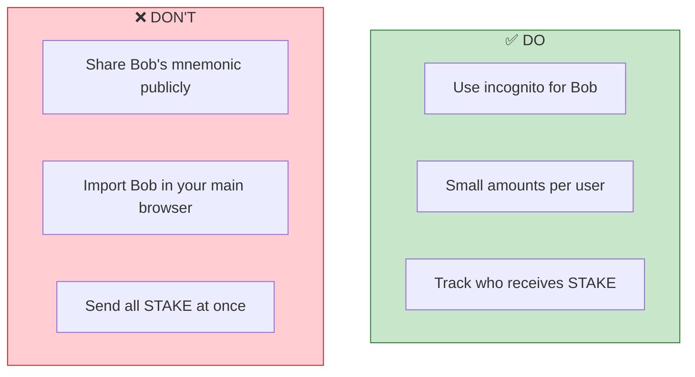
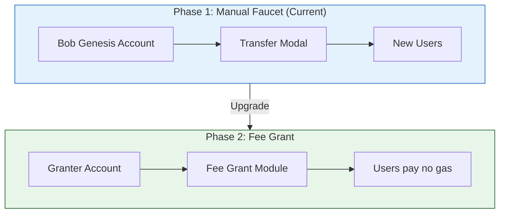

# How to Get STAKE Tokens (Phase 1 Faucet)

> **Purpose**: This guide shows how to distribute STAKE tokens to new users during the testing phase using the "Bob" genesis account as a manual faucet.

## Overview

During Phase 1 testing, new users need STAKE tokens for gas fees. Instead of building a separate faucet service, we use a simple approach:

1. Import the **Bob** test account (which has ~900,000 STAKE from genesis)
2. Use the **Transfer** feature to send STAKE to any wallet



---

## Step 1: Get Bob's Mnemonic

Bob's account is a well-known test account from the genesis configuration.

| Field | Value |
|-------|-------|
| **Address** | `b521hg93rsm2f5v3zlepf20ru88uweajt3nf492s2p` |
| **Balance** | ~899,778 STAKE (as of recent check) |
| **Mnemonic** | See below |

**Bob's Mnemonic (24 words):**
```
vanish legend pelican blush control spike useful usage into any remove wear flee short october naive swear wall spy cup sort avoid agent credit
```

> **Note**: This is a TEST account. Never use test mnemonics for real funds!

---

## Step 2: Import Bob's Wallet



### Instructions:

1. **Open a new browser window** (or incognito/private mode)
   - This keeps your main wallet separate from Bob's wallet

2. **Navigate to the platform**
   - Production: `https://texashodl.net`
   - Local: `http://localhost:5173`

3. **Go to the Genesis State page** (`/admin/genesis`)
   - Find **Bob** in the "Well-Known Test Accounts" section
   - Click the **Copy** button next to the mnemonic

4. **Import the mnemonic**
   - Go to the **Wallet** page
   - Click "Import Seed Phrase"
   - Paste Bob's mnemonic
   - Click "Import"

5. **Verify the import**
   - You should see Bob's address: `b521hg93rsm2f5v3zlepf20ru88uweajt3nf492s2p`
   - Balance should show ~899,778 STAKE

---

## Step 3: Transfer STAKE to a New User



### Instructions:

1. **Click the "Transfer" button** on the Dashboard
   - The button is in the Block52 Game Wallet section

2. **Select STAKE token**
   - Click the "STAKE" button (turns green when selected)
   - You'll see Bob's available STAKE balance

3. **Enter the recipient's address**
   - Get the address from the new user
   - Must start with `b521`

4. **Enter the amount**
   - Recommended: 100 STAKE for new users
   - Click "Use Max" to send the full balance

5. **Click "Send STAKE"**
   - Wait for the transaction to complete
   - The recipient will immediately have STAKE for gas fees

---

## Transfer Modal UI

```
┌─────────────────────────────────────────┐
│         Transfer Tokens                 │
├─────────────────────────────────────────┤
│ Select Token                            │
│ ┌─────────┐  ┌─────────┐               │
│ │  USDC   │  │  STAKE  │ ← Selected    │
│ └─────────┘  └─────────┘               │
│                                         │
│ ┌───────────────────────────────────┐  │
│ │ Available Balance: 899,778 STAKE  │  │
│ └───────────────────────────────────┘  │
│                                         │
│ Recipient Address                       │
│ ┌───────────────────────────────────┐  │
│ │ b521abc123...                     │  │
│ └───────────────────────────────────┘  │
│                                         │
│ Amount (STAKE)                          │
│ ┌───────────────────────────────────┐  │
│ │ 100                               │  │
│ └───────────────────────────────────┘  │
│ Use Max                                 │
│                                         │
│        [Cancel]    [Send STAKE]         │
└─────────────────────────────────────────┘
```

---

## Best Practices

### For Testing Teams

| Scenario | Recommended STAKE Amount |
|----------|-------------------------|
| Developer testing | 1,000 STAKE |
| QA tester | 500 STAKE |
| New user demo | 100 STAKE |
| Stress testing | 10,000 STAKE |

### Security Notes



---

## Finding User Addresses

### Option 1: User Provides Address
- User goes to Dashboard
- Clicks "Copy" next to their Block52 Game Wallet address
- Shares address with admin

### Option 2: Check Genesis State Page
- Go to `/admin/genesis`
- Find the user's address in the accounts list
- Copy their `b521...` address

### Option 3: All Accounts Page
- Go to `/explorer/accounts`
- Find all accounts on chain
- Identify accounts with 0 STAKE balance

---

## Troubleshooting

### "Insufficient funds" Error
- Make sure you selected **STAKE** not USDC
- Check that Bob's wallet still has STAKE balance
- The amount must be less than the available balance

### Transaction Fails
- Ensure the recipient address is valid (starts with `b521`)
- Try a smaller amount
- Check the chain is running (`/explorer/blocks`)

### Bob's Balance is Zero
- Someone may have drained Bob's account
- Check the genesis state page for other funded accounts
- Reset the chain if necessary (local dev only)

---

## Phase 1 Faucet Summary

This manual faucet approach is intentionally simple for Phase 1:



See [PHASES_TO_B52_VALUE.md](./PHASES_TO_B52_VALUE.md) for the complete roadmap.
