# Phases to Increasing B52 Token Value

> **Purpose**: This document outlines the evolution of our gas token strategy from early testing through to production, where B52 token becomes the primary staking/governance token.

## Executive Summary

| Phase | Focus | Gas Token | Who Pays Gas? |
|-------|-------|-----------|---------------|
| **Phase 1** | Game mechanics work | STAKE (testnet) | Faucet distributes free STAKE |
| **Phase 2** | Stable testnet | STAKE | Fee Grant module pays for users |
| **Phase 3** | Production | B52 | Users stake B52 on Ethereum, validators check |

---

## Visual Overview

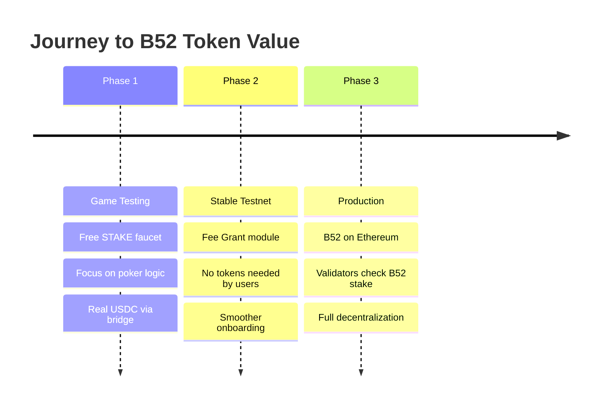

---

## Phase 1: Game Mechanics (Current)

### Goal
Ensure the poker game works smoothly. Players can deposit real USDC via bridge and play.

### Architecture

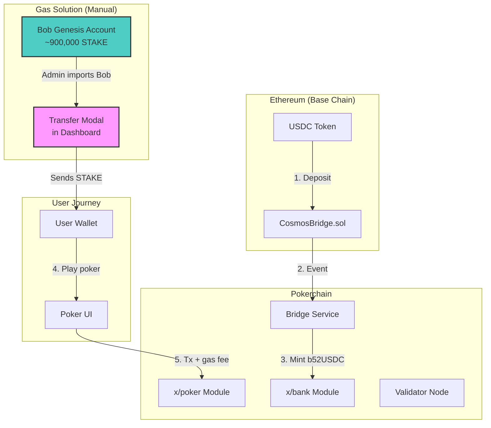

### Gas Token: STAKE via Manual Transfer (Current Implementation)

**Problem**: Users need STAKE to pay transaction fees, but they only bring USDC.

**Solution**: Admin imports Bob's genesis account and uses the Transfer feature to send STAKE.

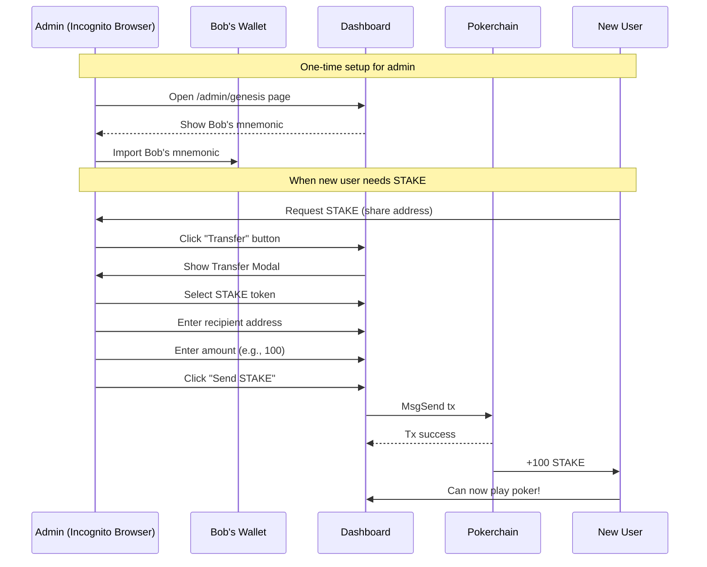

### Current Faucet: Bob's Genesis Account

**Bob is the Phase 1 Faucet!**

| Field | Value |
|-------|-------|
| Address | `b521hg93rsm2f5v3zlepf20ru88uweajt3nf492s2p` |
| Balance | ~899,778 STAKE |
| Mnemonic | `vanish legend pelican blush control spike useful usage into any remove wear flee short october naive swear wall spy cup sort avoid agent credit` |

**How to use:**
1. Open incognito browser
2. Go to `/admin/genesis` and copy Bob's mnemonic
3. Import into wallet
4. Use **Transfer** button → Select **STAKE** → Send to user

> **Detailed Guide**: See [HOW_TO_GET_STAKE_TOKENS.md](./HOW_TO_GET_STAKE_TOKENS.md)

### Why This Works for Phase 1

| Pros | Cons |
|------|------|
| Already implemented | Manual process |
| No additional code needed | Requires admin intervention |
| Uses existing Transfer UI | Not scalable |
| Works immediately | Bob's key shared with team |

### Future Faucet Options (Phase 1b)

#### Option A: Express Endpoint in PVM

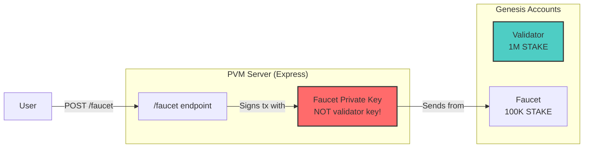

| Pros | Cons |
|------|------|
| Automated | Requires implementation |
| Self-service | Need rate limiting |
| No admin needed | Faucet key is hot wallet |

#### Option B: Cosmos SDK Faucet Module

Uses Ignite's built-in faucet (development only).

```yaml
# config.yml
faucet:
  name: bob
  coins: ["10stake"]
  rate_limit_window: "1h"
```

| Pros | Cons |
|------|------|
| Zero code needed | Development mode only |
| Built-in rate limiting | Not for production |

---

## Phase 2: Stable Testnet

### Goal
Smoother onboarding - users don't need to "get gas" manually.

### Architecture Change

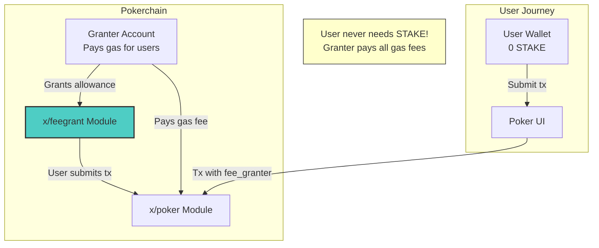

### Gas Token: Fee Grant Module

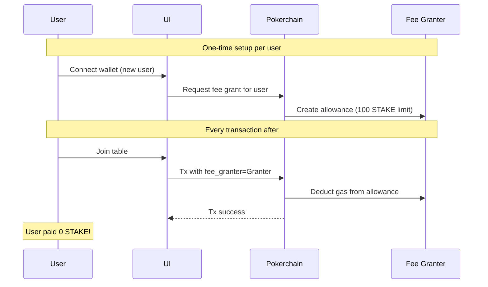

### Comparison: Faucet vs Fee Grant

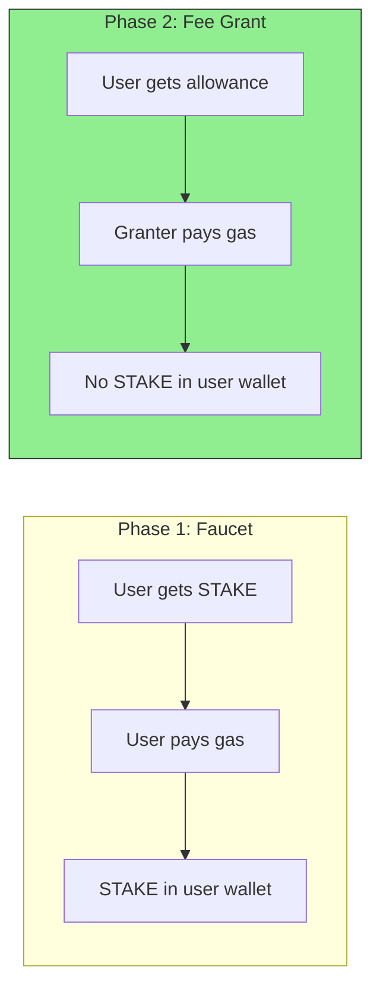

| Aspect | Faucet (Phase 1) | Fee Grant (Phase 2) |
|--------|------------------|---------------------|
| User holds STAKE | Yes | No |
| UX friction | "Get Gas" button | Invisible |
| Accounting | Tokens scattered | Centralized spending |
| Rate limiting | Custom code | Built-in (allowance limits) |
| Cosmos native | No | Yes |

---

## Phase 3: Production (B52 Token)

### Goal
Full decentralization. B52 token on Ethereum determines validator eligibility and user permissions.

### Architecture

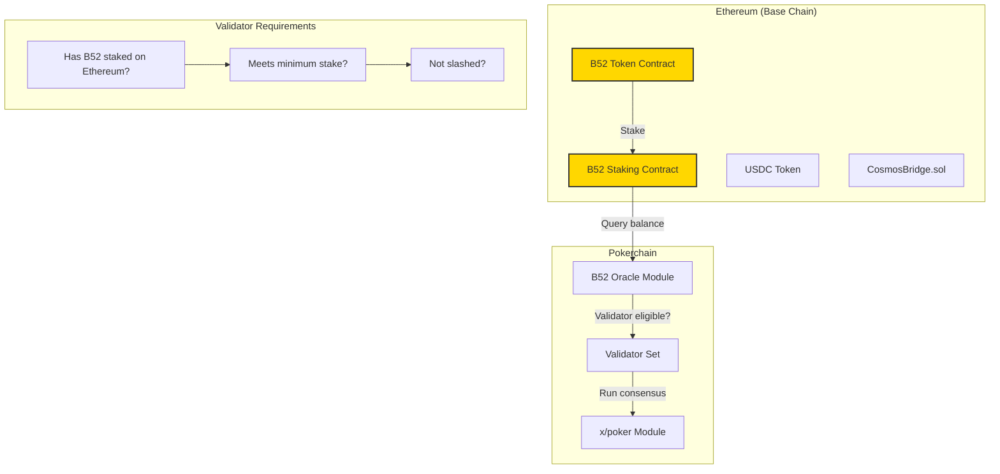

### Gas Token: TBD (Options)

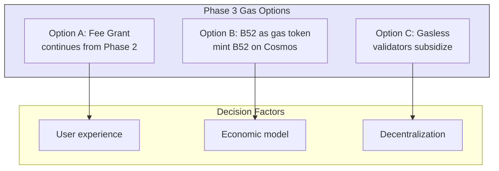

### User Journey in Phase 3

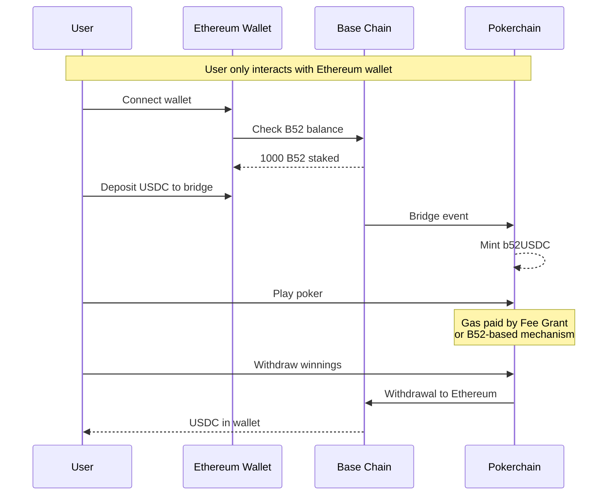

### Validator Economics in Phase 3

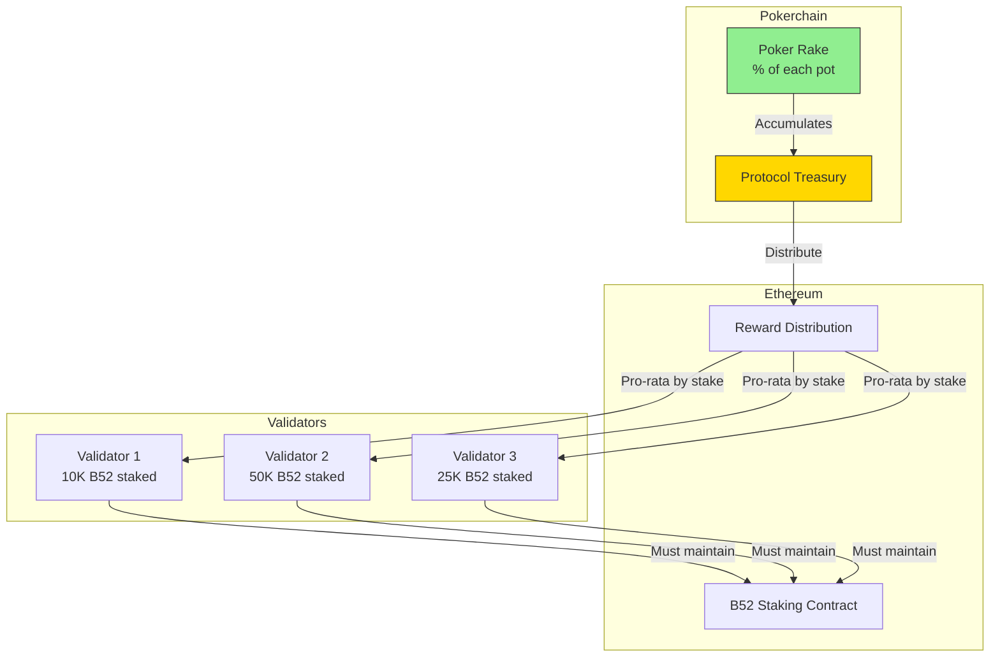

---

## Implementation Roadmap

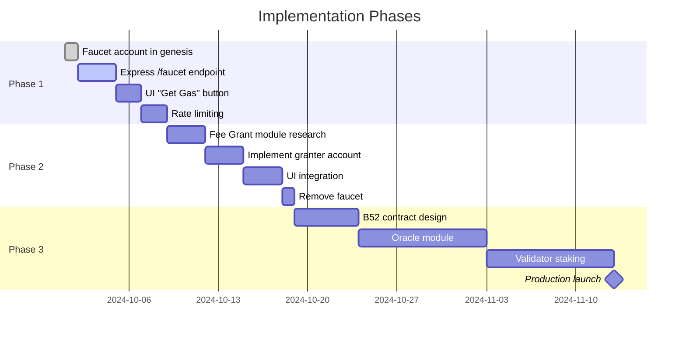

---

## Decision Matrix: Phase 1 Faucet Options

For team discussion - which faucet approach for Phase 1?

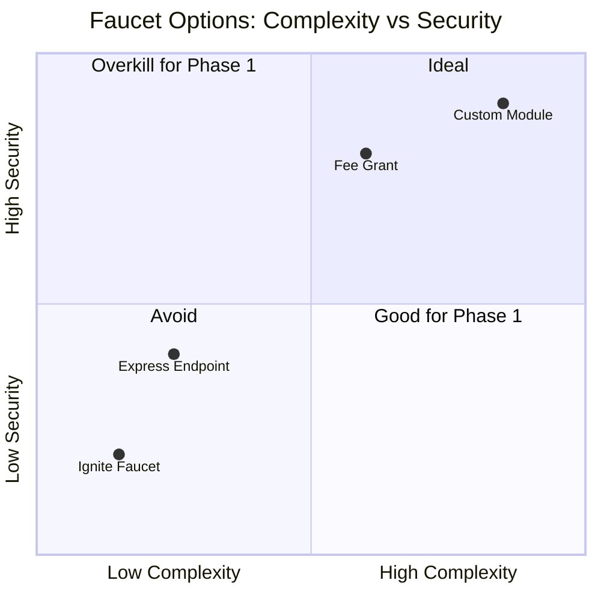

| Option | Complexity | Security | Time to Implement | Recommendation |
|--------|------------|----------|-------------------|----------------|
| **A: Express Endpoint** | Low | Medium | 1-2 days | **Phase 1** |
| **B: Ignite Faucet** | Very Low | Low | 0 days | Local dev only |
| **C: Fee Grant Module** | Medium | High | 3-5 days | **Phase 2** |
| **D: Custom x/faucet** | High | High | 1-2 weeks | Not recommended |

---

## Security Considerations

```mermaid
flowchart TB
    subgraph Critical["CRITICAL: Never Use Validator Key for Faucet"]
        ValidatorKey[Validator Private Key]
        Staked[Controls staked tokens]
        Consensus[Signs consensus votes]
        Danger[If compromised = chain at risk]
    end

    subgraph Safe["SAFE: Dedicated Faucet Account"]
        FaucetKey[Faucet Private Key]
        Limited[Limited STAKE balance]
        Refillable[Can be refilled]
        Isolated[If compromised = only faucet funds at risk]
    end

    ValidatorKey --> Staked --> Consensus --> Danger
    FaucetKey --> Limited --> Refillable --> Isolated

    style Critical fill:#ffcccc,stroke:#ff0000,stroke-width:2px
    style Safe fill:#ccffcc,stroke:#00ff00,stroke-width:2px
```

---

## Open Questions for Team Discussion

1. **Phase 1 Rate Limiting**: How many STAKE per address per day?
   - Suggestion: 100 STAKE/day, 10 STAKE per request

2. **Phase 2 Fee Grant Limits**: How much gas allowance per user?
   - Suggestion: 1000 STAKE allowance, auto-refill monthly

3. **Phase 3 B52 Integration**:
   - Minimum B52 stake to become validator?
   - How to handle Ethereum ↔ Cosmos state sync?
   - Slashing mechanism on Ethereum or Cosmos?

---

## Appendix: Genesis Changes by Phase

### Phase 1 Genesis (Current + Faucet)

```json
{
  "app_state": {
    "bank": {
      "balances": [
        {
          "address": "b521...validator...",
          "coins": [{"denom": "stake", "amount": "1000000000000"}]
        },
        {
          "address": "b521...faucet...",
          "coins": [{"denom": "stake", "amount": "100000000000"}]
        }
      ]
    }
  }
}
```

### Phase 2 Genesis (+ Fee Granter)

```json
{
  "app_state": {
    "bank": {
      "balances": [
        {
          "address": "b521...validator...",
          "coins": [{"denom": "stake", "amount": "1000000000000"}]
        },
        {
          "address": "b521...granter...",
          "coins": [{"denom": "stake", "amount": "500000000000"}]
        }
      ]
    },
    "feegrant": {
      "allowances": []
    }
  }
}
```

---

## Summary

| Phase | User Experience | Technical Approach | B52 Token Role |
|-------|----------------|-------------------|----------------|
| **1** | "Get Gas" button | Express faucet endpoint | None |
| **2** | Invisible gas | Fee Grant module | None |
| **3** | Connect Ethereum wallet | B52 staking oracle | Validator eligibility + governance |

**Next Steps for Team**:
1. Decide on Phase 1 faucet implementation (Option A recommended)
2. Define rate limiting parameters
3. Plan Phase 2 Fee Grant integration timeline
4. Research B52 staking contract requirements for Phase 3
