# Production Node Setup Process

> **Purpose**: This document explains the complete process for setting up production validator nodes for Pokerchain, from initial configuration generation through remote deployment.

## Overview

Production deployment is a **two-phase process**:

1. **Phase A: Local Configuration Generation** (`setup-production-nodes.sh`)
   - Runs on your development machine
   - Generates all node configs, keys, and genesis in `./production/` directory
   - Creates deployment scripts for each node

2. **Phase B: Remote Deployment** (`deploy-production-node.sh`)
   - Deploys generated configs to remote servers via SSH
   - Installs binary, sets up systemd, configures firewall

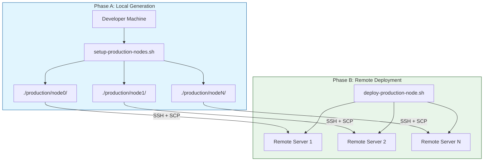

---

## Phase A: Configuration Generation

### Script: `setup-production-nodes.sh`

This script generates all production configurations locally before any remote deployment.

### High-Level Flow

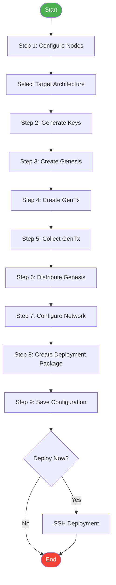

### Step-by-Step Breakdown

#### Step 1: Configure Node Information

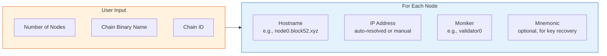

**What happens:**
- Prompts for number of validator nodes (default: 4)
- For each node:
  - Hostname (used for peer connections)
  - IP address (auto-resolved from hostname, or manual entry)
  - Moniker (human-readable name)
  - Mnemonic (optional, for recoverable keys)

#### Step 2: Initialize Nodes & Generate Keys

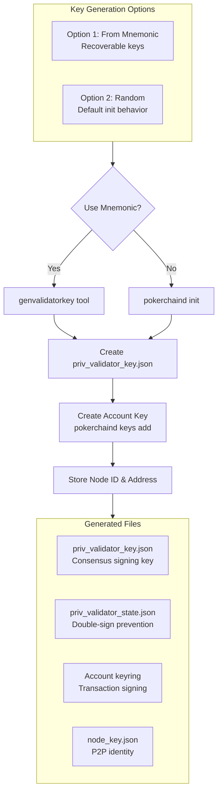

**Key files generated per node:**

| File | Purpose | Security Level |
|------|---------|----------------|
| `priv_validator_key.json` | Signs consensus votes | CRITICAL - backup required |
| `priv_validator_state.json` | Prevents double-signing | Important |
| `node_key.json` | P2P network identity | Moderate |
| Keyring files | Signs transactions | Important |

#### Step 3: Add Genesis Accounts

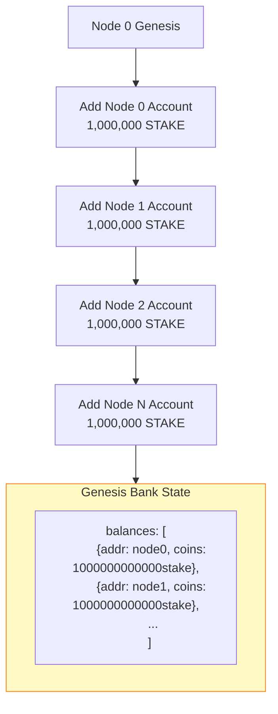

**Command executed:**
```bash
pokerchaind genesis add-genesis-account $VALIDATOR_ADDR 1000000000000stake \
    --home $OUTPUT_DIR/node0
```

**Note:** Only STAKE is given at genesis (no USDC - that comes from bridge deposits).

#### Step 4: Create Genesis Transactions (GenTx)

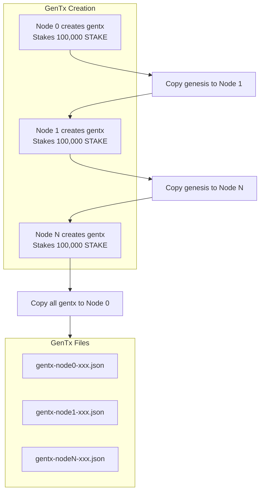

**What a GenTx contains:**
- `MsgCreateValidator` - registers the validator
- Stake amount (100,000 STAKE = 100000000000ustake)
- Commission rates
- Validator public key
- Node ID and IP (for peer discovery)

#### Step 5: Collect Genesis Transactions

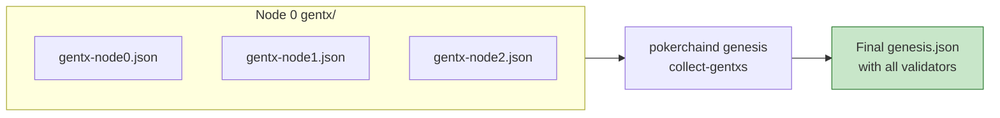

**Command:**
```bash
pokerchaind genesis collect-gentxs --home $OUTPUT_DIR/node0
```

#### Step 6: Distribute Final Genesis

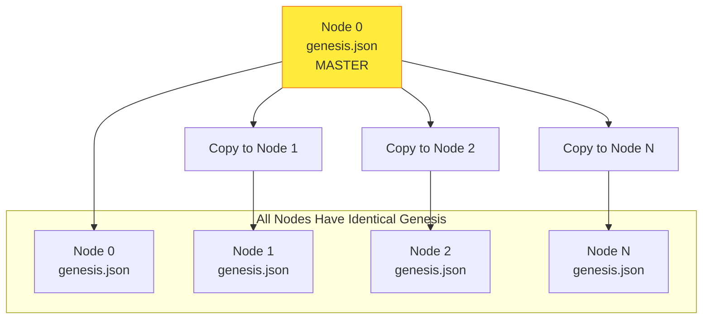

**Critical:** All nodes MUST have identical `genesis.json` or they will fail to reach consensus.

#### Step 7: Configure Network Settings

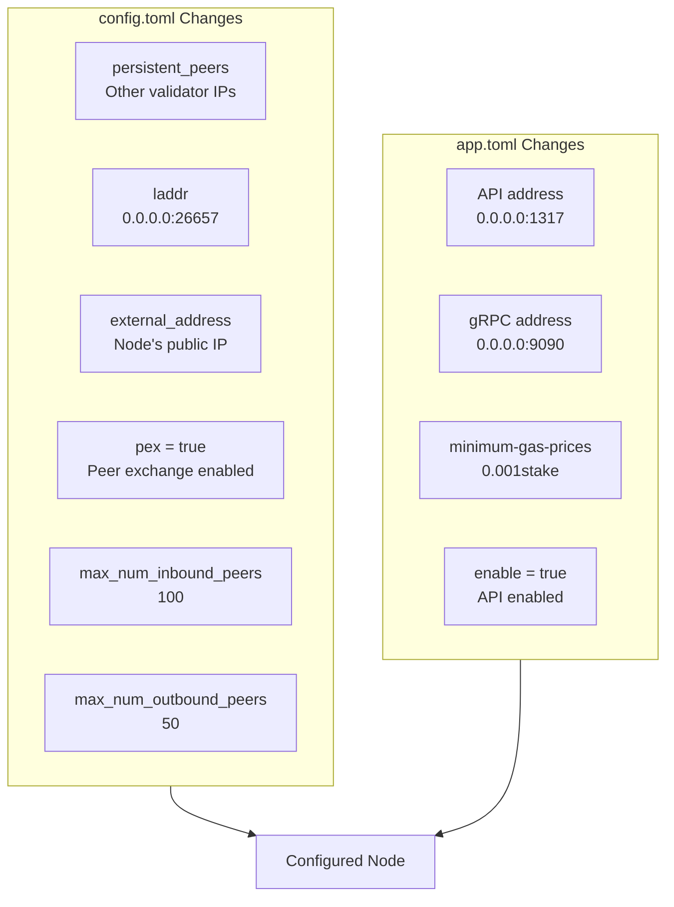

**Persistent Peers Format:**
```
node_id1@ip1:26656,node_id2@ip2:26656,node_id3@ip3:26656
```

#### Step 8: Create Deployment Package

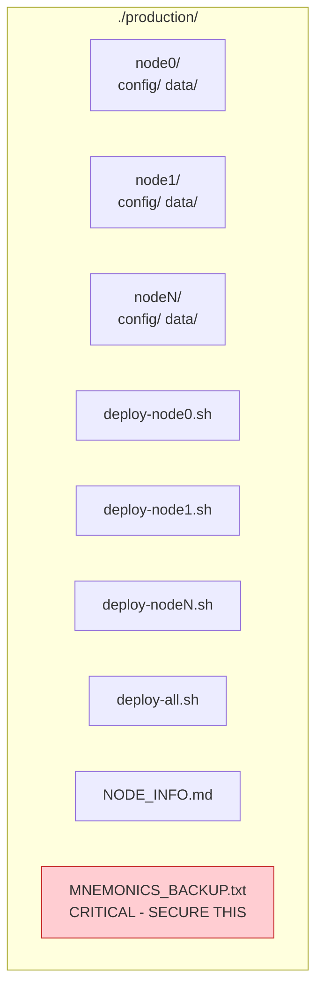

**Files generated per node:**
```
./production/
├── node0/
│   ├── config/
│   │   ├── app.toml
│   │   ├── config.toml
│   │   ├── genesis.json
│   │   ├── node_key.json
│   │   └── priv_validator_key.json
│   └── data/
│       └── priv_validator_state.json
├── node1/
│   └── ...
├── deploy-node0.sh
├── deploy-node1.sh
├── deploy-all.sh
├── NODE_INFO.md
└── MNEMONICS_BACKUP.txt  (if using mnemonic keys)
```

---

## Phase B: Remote Deployment

### Script: `deploy-production-node.sh`

This script deploys a single node to a remote server.

### High-Level Flow

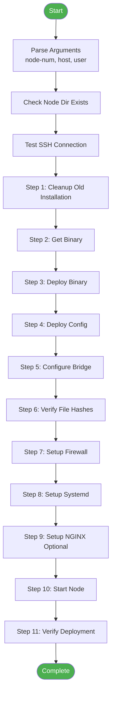

### Step-by-Step Breakdown

#### Step 1: Cleanup Old Installation

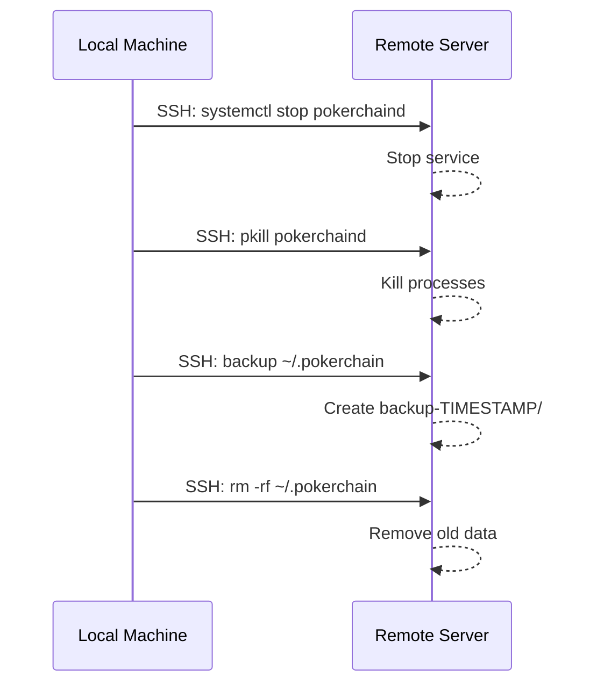

#### Step 2: Get Binary

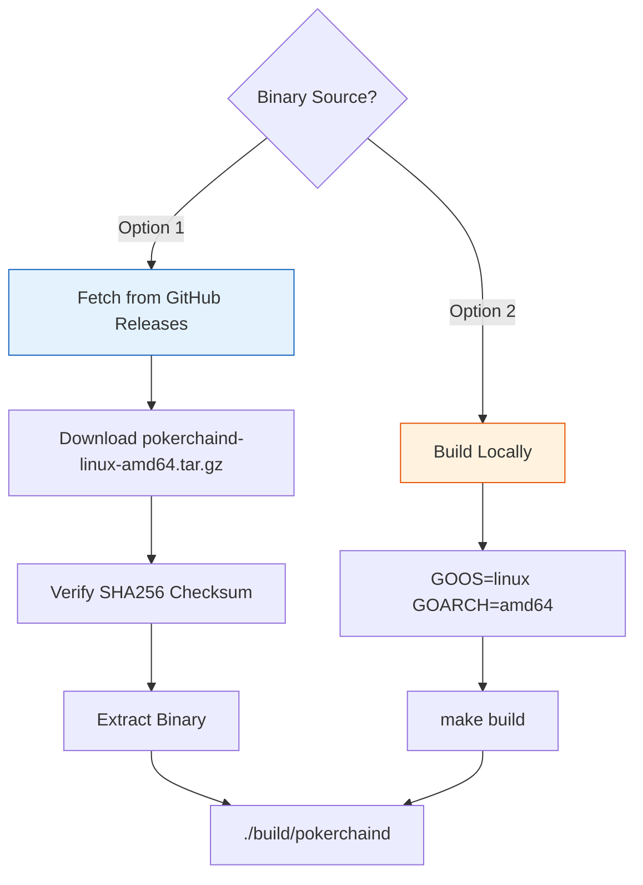

#### Step 3: Deploy Binary

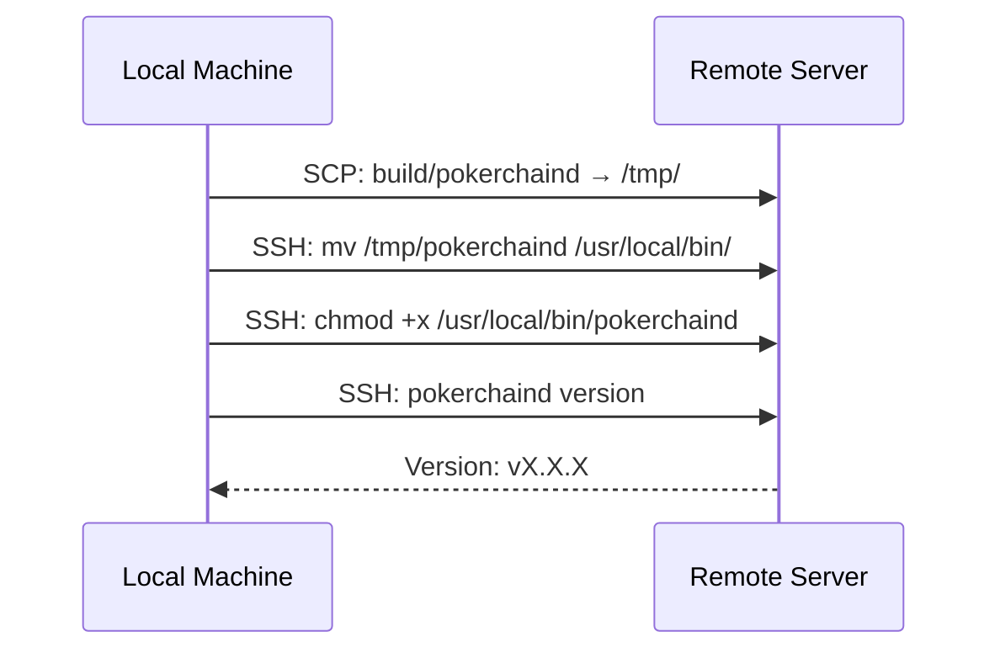

#### Step 4: Deploy Configuration

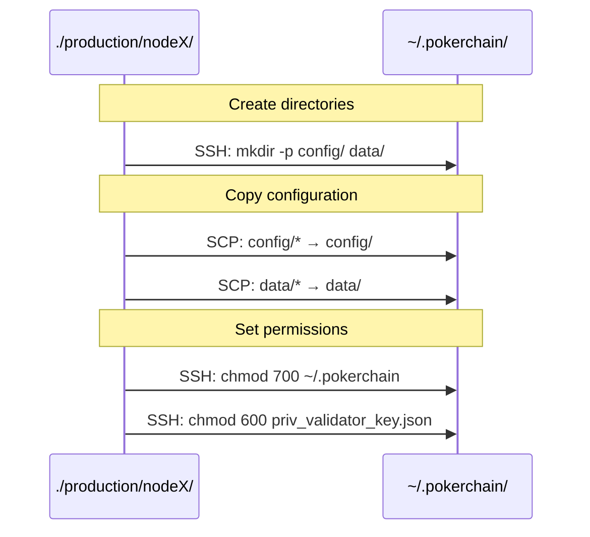

**Files deployed:**
```
~/.pokerchain/
├── config/
│   ├── app.toml
│   ├── config.toml
│   ├── genesis.json
│   ├── node_key.json
│   └── priv_validator_key.json
└── data/
    └── priv_validator_state.json
```

#### Step 5: Configure Bridge

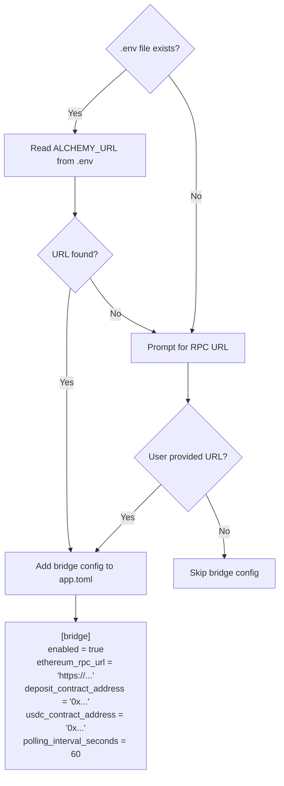

#### Step 6: Verify File Hashes

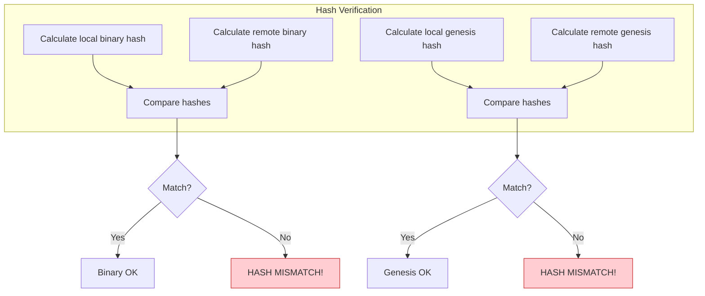

#### Step 7-8: Setup Firewall & Systemd

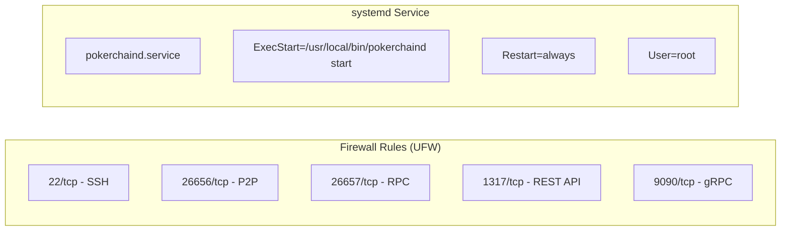

#### Step 9: Start & Verify

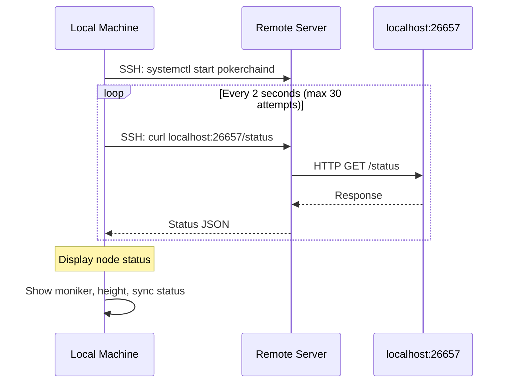

---

## Complete Deployment Timeline

```mermaid
gantt
    title Production Deployment Timeline
    dateFormat HH:mm
    axisFormat %H:%M

    section Phase A (Local)
    Configure nodes           :a1, 00:00, 5m
    Generate keys             :a2, after a1, 3m
    Create genesis            :a3, after a2, 2m
    Create gentx              :a4, after a3, 2m
    Collect & distribute      :a5, after a4, 1m
    Configure network         :a6, after a5, 2m
    Create deployment scripts :a7, after a6, 1m

    section Phase B (Per Node)
    Cleanup old installation  :b1, after a7, 2m
    Build/fetch binary        :b2, after b1, 5m
    Deploy binary & config    :b3, after b2, 3m
    Configure bridge          :b4, after b3, 2m
    Setup firewall & systemd  :b5, after b4, 3m
    Start & verify            :b6, after b5, 2m
```

---

## Network Architecture

```mermaid
flowchart TB
    subgraph Validators["Validator Network"]
        V0[Node 0<br/>node0.block52.xyz<br/>:26656]
        V1[Node 1<br/>node1.block52.xyz<br/>:26656]
        V2[Node 2<br/>node2.block52.xyz<br/>:26656]
        V3[Node 3<br/>node3.block52.xyz<br/>:26656]

        V0 <-->|P2P| V1
        V0 <-->|P2P| V2
        V0 <-->|P2P| V3
        V1 <-->|P2P| V2
        V1 <-->|P2P| V3
        V2 <-->|P2P| V3
    end

    subgraph External["External Access"]
        RPC[RPC :26657]
        API[REST API :1317]
        GRPC[gRPC :9090]
    end

    subgraph Users["Users & Services"]
        UI[Poker UI]
        Explorer[Block Explorer]
        Bridge[Bridge Service]
    end

    V0 --> RPC
    V0 --> API
    V0 --> GRPC

    UI --> RPC
    Explorer --> API
    Bridge --> RPC

    style Validators fill:#e8f5e9,stroke:#1b5e20
```

---

## Security Checklist

```mermaid
flowchart TD
    subgraph Critical["CRITICAL"]
        C1[Backup priv_validator_key.json]
        C2[Secure MNEMONICS_BACKUP.txt]
        C3[Never expose validator key]
    end

    subgraph Important["Important"]
        I1[Configure firewall]
        I2[Use SSH keys, not passwords]
        I3[Enable systemd auto-restart]
        I4[Set minimum-gas-prices]
    end

    subgraph Recommended["Recommended"]
        R1[Setup monitoring/alerting]
        R2[Configure TLS for API]
        R3[Regular backups]
        R4[Log rotation]
    end

    style Critical fill:#ffcdd2,stroke:#c62828
    style Important fill:#fff9c4,stroke:#f57f17
    style Recommended fill:#c8e6c9,stroke:#2e7d32
```

### Mnemonic Security

```mermaid
flowchart LR
    Generate[Generate Mnemonics] --> Backup[Backup to Secure Storage]
    Backup --> Encrypt[Encrypt with GPG]
    Encrypt --> MultiLoc[Store in Multiple Locations]
    MultiLoc --> Delete[Securely Delete Plaintext<br/>shred -u MNEMONICS_BACKUP.txt]

    style Delete fill:#c8e6c9,stroke:#2e7d32
```

---

## Troubleshooting

### Common Issues

```mermaid
flowchart TD
    Issue1[Node won't start] --> Check1{Check logs}
    Check1 --> Log1[journalctl -u pokerchaind -f]

    Issue2[Peers not connecting] --> Check2{Check config}
    Check2 --> Peer1[Verify persistent_peers in config.toml]
    Check2 --> Peer2[Check firewall allows :26656]
    Check2 --> Peer3[Verify external_address is set]

    Issue3[Genesis mismatch] --> Check3{Compare hashes}
    Check3 --> Hash1[sha256sum genesis.json on all nodes]
    Hash1 --> Fix1[Copy master genesis to all nodes]

    Issue4[Double signing] --> Check4{Check state}
    Check4 --> State1[Never run same validator on 2 machines!]
    Check4 --> State2[Check priv_validator_state.json]
```

### Useful Commands

| Task | Command |
|------|---------|
| Check logs | `journalctl -u pokerchaind -f` |
| Check sync status | `curl localhost:26657/status \| jq .result.sync_info` |
| Check peers | `curl localhost:26657/net_info \| jq .result.n_peers` |
| Restart node | `systemctl restart pokerchaind` |
| Check validators | `pokerchaind query staking validators` |

---

## Quick Reference

### Files to Backup

| File | Location | Purpose |
|------|----------|---------|
| `priv_validator_key.json` | `~/.pokerchain/config/` | Consensus signing |
| `node_key.json` | `~/.pokerchain/config/` | P2P identity |
| `MNEMONICS_BACKUP.txt` | `./production/` | Key recovery |

### Default Ports

| Port | Service | Protocol |
|------|---------|----------|
| 26656 | P2P | TCP |
| 26657 | RPC | HTTP |
| 1317 | REST API | HTTP |
| 9090 | gRPC | HTTP/2 |

### Initial Token Distribution

| Account | STAKE | USDC |
|---------|-------|------|
| Each Validator | 1,000,000 | 0 |
| Staked per Validator | 100,000 | - |

---

## Script Reference: Important Lines

### `setup-production-nodes.sh`

| Line(s) | Purpose | Code |
|---------|---------|------|
| **24-25** | Initial token amounts | `STAKE_AMOUNT="100000000000stake"`<br/>`INITIAL_BALANCE="1000000000000stake"` |
| **134-188** | Build binary for target architecture | `build_for_target()` function |
| **356-445** | Generate validator key from mnemonic | `generate_validator_key_from_mnemonic()` function |
| **478-559** | Collect node info (hostname, IP, moniker, mnemonic) | Interactive prompts per node |
| **628-721** | Initialize nodes and generate keys | Main node initialization loop |
| **676** | `pokerchaind init` command | `$CHAIN_BINARY init $NODE_MONIKER --chain-id $CHAIN_ID --home $NODE_HOME` |
| **707-710** | Create account key | `$CHAIN_BINARY keys add $NODE_MONIKER` |
| **743-749** | Add genesis accounts | `$CHAIN_BINARY genesis add-genesis-account` |
| **745** | Genesis account balance (STAKE only) | `$INITIAL_BALANCE` = 1,000,000 STAKE |
| **770-775** | Create gentx | `$CHAIN_BINARY genesis gentx $NODE_MONIKER $STAKE_AMOUNT` |
| **791** | Collect all gentx | `$CHAIN_BINARY genesis collect-gentxs` |
| **800-803** | Distribute final genesis | Copy genesis.json to all nodes |
| **827-835** | Build persistent_peers list | Excludes self, includes all other validators |
| **838** | Set persistent_peers in config.toml | `sed` replacement |
| **842-852** | Production P2P settings | External address, pex, max peers |
| **869-877** | Set minimum gas prices | `minimum-gas-prices = "0.001stake"` |
| **894-980** | Create deployment scripts | Per-node and master deploy scripts |
| **1036-1228** | Generate NODE_INFO.md | Documentation and instructions |

### `deploy-production-node.sh`

| Line(s) | Purpose | Code |
|---------|---------|------|
| **97-151** | Cleanup old installation | `cleanup_old_installation()` |
| **108-127** | Stop existing processes | `systemctl stop`, `pkill` |
| **131-141** | Backup existing data | Creates timestamped backup |
| **154-242** | Fetch binary from GitHub | `fetch_binary_from_github()` |
| **163** | Get latest release | GitHub API call |
| **190-215** | Download and verify checksum | SHA256 verification |
| **245-266** | Build binary locally | `build_binary()` with `GOOS=linux GOARCH=amd64` |
| **269-291** | Deploy binary to remote | `deploy_binary()` via SCP |
| **280** | SCP binary | `scp build/pokerchaind "$remote_user@$remote_host:/tmp/"` |
| **283** | Install to /usr/local/bin | `sudo mv /tmp/pokerchaind /usr/local/bin/` |
| **294-332** | Deploy configuration | `deploy_config()` |
| **310** | Copy config files | `scp -r "$node_dir/config/"* ...` |
| **320-326** | Set file permissions | `chmod 700`, `chmod 600` |
| **335-416** | Configure bridge | `configure_bridge()` |
| **388-412** | Bridge config template | Appended to app.toml |
| **527-598** | Verify file hashes | `verify_file_hashes()` |
| **543-554** | Binary hash comparison | `sha256sum` local vs remote |
| **561-573** | Genesis hash comparison | Ensures identical genesis |
| **502-524** | Start node | `start_node()` |
| **513** | Start systemd service | `sudo systemctl start pokerchaind` |
| **601-635** | Verify deployment | `verify_deployment()` |
| **616** | Check RPC responding | `curl localhost:26657/status` |

### `run-local-testnet.sh` (for comparison)

| Line(s) | Purpose | Code |
|---------|---------|------|
| **215** | Get validator address | `pokerchaind keys show validator -a` |
| **220** | Add genesis account | `pokerchaind genesis add-genesis-account "$validator_addr" 1000000000000stake` |
| **224-227** | Create gentx | `pokerchaind genesis gentx validator 5000000000stake` |

### Key Differences: Local vs Production

| Aspect | `run-local-testnet.sh` | `setup-production-nodes.sh` |
|--------|------------------------|----------------------------|
| Stake amount | 5,000 STAKE (line 224) | 100,000 STAKE (line 24) |
| Key generation | Random | Mnemonic-based (recoverable) |
| Output | `~/.pokerchain-testnet/` | `./production/nodeX/` |
| Deployment | Local only | SSH to remote servers |
| Genesis accounts | Single validator | Multiple validators |

---

## Summary

1. **Run `setup-production-nodes.sh`** on your development machine
   - Generates all configs in `./production/`
   - Creates deployment scripts

2. **Run `deploy-production-node.sh`** for each node
   - Or use `./production/deploy-all.sh` to deploy all at once
   - Installs binary, config, systemd service

3. **Secure your keys**
   - Backup `priv_validator_key.json`
   - Encrypt and store `MNEMONICS_BACKUP.txt`

4. **Verify the network**
   - All nodes should connect as peers
   - All validators should be in the active set
